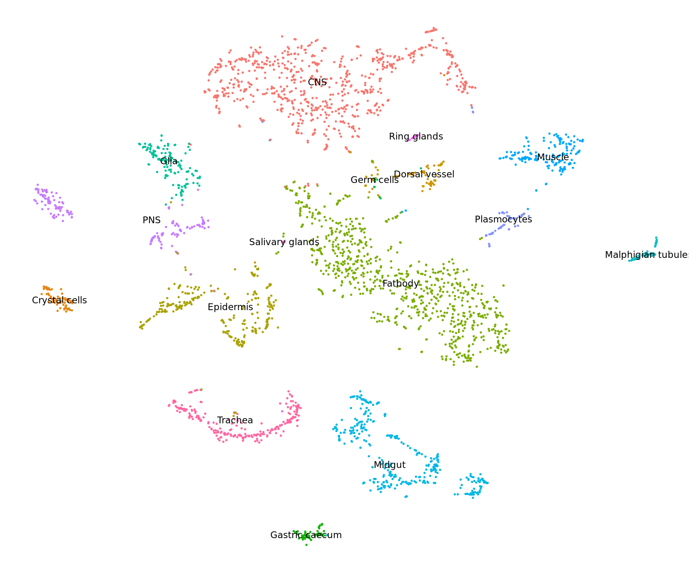

Annotate the clusters based on MCC correlation and manual identification with markers and replot TSNE projection 


**Project:** Promoter Opening

**Author:** [Vivek](mailto:vir@stowers.org)

**Generated:** Mon May 07 2018, 03:39 AM




```
## [1] "Finished averaging RNA for cluster CNS"
## [1] "Finished averaging RNA for cluster Crystal cells"
## [1] "Finished averaging RNA for cluster Dorsal vessel"
## [1] "Finished averaging RNA for cluster Epidermis"
## [1] "Finished averaging RNA for cluster Fatbody"
## [1] "Finished averaging RNA for cluster Gastric caecum"
## [1] "Finished averaging RNA for cluster Germ cells"
## [1] "Finished averaging RNA for cluster Glia"
## [1] "Finished averaging RNA for cluster Malphigian tubules"
## [1] "Finished averaging RNA for cluster Midgut"
## [1] "Finished averaging RNA for cluster Muscle"
## [1] "Finished averaging RNA for cluster Plasmocytes"
## [1] "Finished averaging RNA for cluster PNS"
## [1] "Finished averaging RNA for cluster Ring glands"
## [1] "Finished averaging RNA for cluster Salivary glands"
## [1] "Finished averaging RNA for cluster Trachea"
```


## Session information

For reproducibility, this analysis was performed with the following R/Bioconductor session:


```
R version 3.4.4 (2018-03-15)
Platform: x86_64-pc-linux-gnu (64-bit)
Running under: Ubuntu 16.04.4 LTS

Matrix products: default
BLAS: /usr/lib/libblas/libblas.so.3.6.0
LAPACK: /usr/lib/lapack/liblapack.so.3.6.0

locale:
 [1] LC_CTYPE=en_US.UTF-8       LC_NUMERIC=C              
 [3] LC_TIME=en_US.UTF-8        LC_COLLATE=en_US.UTF-8    
 [5] LC_MONETARY=en_US.UTF-8    LC_MESSAGES=en_US.UTF-8   
 [7] LC_PAPER=en_US.UTF-8       LC_NAME=C                 
 [9] LC_ADDRESS=C               LC_TELEPHONE=C            
[11] LC_MEASUREMENT=en_US.UTF-8 LC_IDENTIFICATION=C       

attached base packages:
[1] stats     graphics  grDevices utils     datasets  base     

other attached packages:
 [1] bindrcpp_0.2.2     mccr_0.4.4         RColorBrewer_1.1-2 magrittr_1.5      
 [5] dplyr_0.7.4        tidyr_0.8.0        Seurat_2.3.0       Matrix_1.2-14     
 [9] cowplot_0.9.2      ggplot2_2.2.1      pander_0.6.1       knitr_1.20        

loaded via a namespace (and not attached):
  [1] snow_0.4-2           backports_1.1.2      Hmisc_4.1-1         
  [4] VGAM_1.0-5           sn_1.5-2             plyr_1.8.4          
  [7] igraph_1.2.1         lazyeval_0.2.1       splines_3.4.4       
 [10] digest_0.6.15        foreach_1.4.4        htmltools_0.3.6     
 [13] lars_1.2             gdata_2.18.0         checkmate_1.8.5     
 [16] cluster_2.0.7-1      mixtools_1.1.0       ROCR_1.0-7          
 [19] sfsmisc_1.1-2        recipes_0.1.2        gower_0.1.2         
 [22] dimRed_0.1.0         R.utils_2.6.0        methods_3.4.4       
 [25] colorspace_1.3-2     bindr_0.1.1          survival_2.42-3     
 [28] zoo_1.8-1            iterators_1.0.9      ape_5.1             
 [31] glue_1.2.0           DRR_0.0.3            gtable_0.2.0        
 [34] ipred_0.9-6          kernlab_0.9-26       ddalpha_1.3.3       
 [37] prabclus_2.2-6       DEoptimR_1.0-8       abind_1.4-5         
 [40] scales_0.5.0         mvtnorm_1.0-7        Rcpp_0.12.16        
 [43] metap_0.9            dtw_1.18-1           htmlTable_1.11.2    
 [46] magic_1.5-8          tclust_1.3-1         foreign_0.8-70      
 [49] proxy_0.4-22         mclust_5.4           SDMTools_1.1-221    
 [52] Formula_1.2-3        stats4_3.4.4         tsne_0.1-3          
 [55] lava_1.6.1           prodlim_2018.04.18   htmlwidgets_1.2     
 [58] FNN_1.1              gplots_3.0.1         fpc_2.1-11          
 [61] acepack_1.4.1        modeltools_0.2-21    ica_1.0-1           
 [64] pkgconfig_2.0.1      R.methodsS3_1.7.1    flexmix_2.3-14      
 [67] nnet_7.3-12          caret_6.0-79         tidyselect_0.2.4    
 [70] labeling_0.3         rlang_0.2.0          reshape2_1.4.3      
 [73] munsell_0.4.3        tools_3.4.4          ranger_0.9.0        
 [76] broom_0.4.4          ggridges_0.5.0       evaluate_0.10.1     
 [79] geometry_0.3-6       stringr_1.3.0        ModelMetrics_1.1.0  
 [82] fitdistrplus_1.0-9   robustbase_0.93-0    caTools_1.17.1      
 [85] purrr_0.2.4          RANN_2.5.1           pbapply_1.3-4       
 [88] nlme_3.1-137         R.oo_1.22.0          RcppRoll_0.2.2      
 [91] compiler_3.4.4       rstudioapi_0.7       png_0.1-7           
 [94] tibble_1.4.2         stringi_1.2.2        highr_0.6           
 [97] lattice_0.20-35      trimcluster_0.1-2    psych_1.8.3.3       
[100] diffusionMap_1.1-0   pillar_1.2.2         lmtest_0.9-36       
[103] data.table_1.11.0    bitops_1.0-6         irlba_2.3.2         
[106] R6_2.2.2             latticeExtra_0.6-28  KernSmooth_2.23-15  
[109] gridExtra_2.3        codetools_0.2-15     MASS_7.3-50         
[112] gtools_3.5.0         assertthat_0.2.0     CVST_0.2-1          
[115] withr_2.1.2          mnormt_1.5-5         diptest_0.75-7      
[118] parallel_3.4.4       doSNOW_1.0.16        grid_3.4.4          
[121] rpart_4.1-13         timeDate_3043.102    class_7.3-14        
[124] segmented_0.5-3.0    Cairo_1.5-9          Rtsne_0.13          
[127] numDeriv_2016.8-1    scatterplot3d_0.3-41 lubridate_1.7.4     
[130] base64enc_0.1-3     
```
