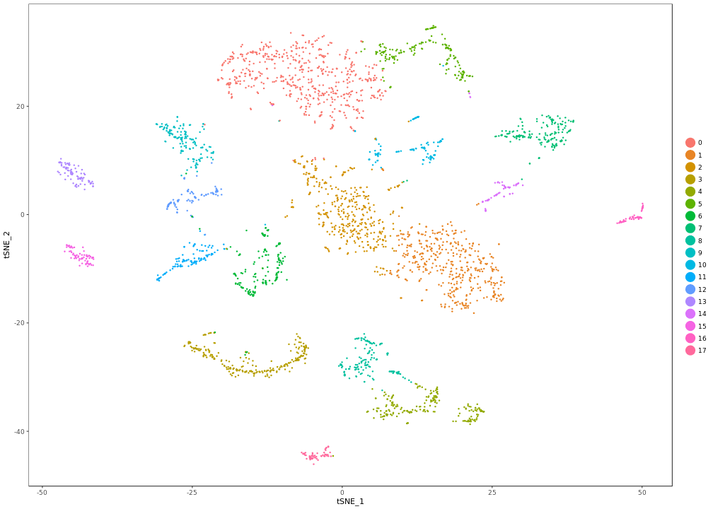

```
## Loading required package: ggplot2
```

```
## Loading required package: cowplot
```

```
## 
## Attaching package: 'cowplot'
```

```
## The following object is masked from 'package:ggplot2':
## 
##     ggsave
```

```
## Loading required package: Matrix
```

```
## 
## Attaching package: 'tidyr'
```

```
## The following object is masked from 'package:Matrix':
## 
##     expand
```

```
## 
## Attaching package: 'dplyr'
```

```
## The following objects are masked from 'package:stats':
## 
##     filter, lag
```

```
## The following objects are masked from 'package:base':
## 
##     intersect, setdiff, setequal, union
```

```
## 
## Attaching package: 'magrittr'
```

```
## The following object is masked from 'package:tidyr':
## 
##     extract
```


Normalize and process wt single cell data 14-14.5hrs from two replicates

**Project:** Promoter Opening

**Author:** [Vivek](mailto:vir@stowers.org)

**Generated:** Fri May 04 2018, 10:11 PM


```
## [1] "Scaling data matrix"
## 
  |                                                                            
  |                                                                      |   0%
  |                                                                            
  |====                                                                  |   6%
  |                                                                            
  |========                                                              |  11%
  |                                                                            
  |============                                                          |  17%
  |                                                                            
  |================                                                      |  22%
  |                                                                            
  |===================                                                   |  28%
  |                                                                            
  |=======================                                               |  33%
  |                                                                            
  |===========================                                           |  39%
  |                                                                            
  |===============================                                       |  44%
  |                                                                            
  |===================================                                   |  50%
  |                                                                            
  |=======================================                               |  56%
  |                                                                            
  |===========================================                           |  61%
  |                                                                            
  |===============================================                       |  67%
  |                                                                            
  |===================================================                   |  72%
  |                                                                            
  |======================================================                |  78%
  |                                                                            
  |==========================================================            |  83%
  |                                                                            
  |==============================================================        |  89%
  |                                                                            
  |==================================================================    |  94%
  |                                                                            
  |======================================================================| 100%
```




## Session information

For reproducibility, this analysis was performed with the following R/Bioconductor session:


```
R version 3.4.4 (2018-03-15)
Platform: x86_64-pc-linux-gnu (64-bit)
Running under: Ubuntu 16.04.4 LTS

Matrix products: default
BLAS: /usr/lib/libblas/libblas.so.3.6.0
LAPACK: /usr/lib/lapack/liblapack.so.3.6.0

locale:
 [1] LC_CTYPE=en_US.UTF-8       LC_NUMERIC=C              
 [3] LC_TIME=en_US.UTF-8        LC_COLLATE=en_US.UTF-8    
 [5] LC_MONETARY=en_US.UTF-8    LC_MESSAGES=en_US.UTF-8   
 [7] LC_PAPER=en_US.UTF-8       LC_NAME=C                 
 [9] LC_ADDRESS=C               LC_TELEPHONE=C            
[11] LC_MEASUREMENT=en_US.UTF-8 LC_IDENTIFICATION=C       

attached base packages:
[1] stats     graphics  grDevices utils     datasets  base     

other attached packages:
 [1] RColorBrewer_1.1-2 magrittr_1.5       dplyr_0.7.4        tidyr_0.8.0       
 [5] Seurat_2.3.0       Matrix_1.2-14      cowplot_0.9.2      ggplot2_2.2.1     
 [9] pander_0.6.1       knitr_1.20        

loaded via a namespace (and not attached):
  [1] diffusionMap_1.1-0   Rtsne_0.13           VGAM_1.0-5          
  [4] colorspace_1.3-2     ggridges_0.5.0       class_7.3-14        
  [7] modeltools_0.2-21    mclust_5.4           htmlTable_1.11.2    
 [10] base64enc_0.1-3      proxy_0.4-22         rstudioapi_0.7      
 [13] DRR_0.0.3            flexmix_2.3-14       lubridate_1.7.4     
 [16] prodlim_2018.04.18   mvtnorm_1.0-7        ranger_0.9.0        
 [19] codetools_0.2-15     splines_3.4.4        R.methodsS3_1.7.1   
 [22] mnormt_1.5-5         robustbase_0.93-0    tclust_1.3-1        
 [25] RcppRoll_0.2.2       Formula_1.2-3        caret_6.0-79        
 [28] ica_1.0-1            broom_0.4.4          ddalpha_1.3.3       
 [31] cluster_2.0.7-1      kernlab_0.9-26       png_0.1-7           
 [34] R.oo_1.22.0          sfsmisc_1.1-2        compiler_3.4.4      
 [37] backports_1.1.2      assertthat_0.2.0     lazyeval_0.2.1      
 [40] lars_1.2             acepack_1.4.1        htmltools_0.3.6     
 [43] tools_3.4.4          bindrcpp_0.2.2       igraph_1.2.1        
 [46] gtable_0.2.0         glue_1.2.0           RANN_2.5.1          
 [49] reshape2_1.4.3       Rcpp_0.12.16         trimcluster_0.1-2   
 [52] gdata_2.18.0         ape_5.1              nlme_3.1-137        
 [55] iterators_1.0.9      fpc_2.1-11           lmtest_0.9-36       
 [58] psych_1.8.3.3        timeDate_3043.102    gower_0.1.2         
 [61] stringr_1.3.0        irlba_2.3.2          gtools_3.5.0        
 [64] DEoptimR_1.0-8       zoo_1.8-1            MASS_7.3-50         
 [67] scales_0.5.0         ipred_0.9-6          doSNOW_1.0.16       
 [70] parallel_3.4.4       pbapply_1.3-4        gridExtra_2.3       
 [73] segmented_0.5-3.0    rpart_4.1-13         latticeExtra_0.6-28 
 [76] stringi_1.2.2        highr_0.6            foreach_1.4.4       
 [79] checkmate_1.8.5      caTools_1.17.1       lava_1.6.1          
 [82] geometry_0.3-6       dtw_1.18-1           SDMTools_1.1-221    
 [85] rlang_0.2.0          pkgconfig_2.0.1      prabclus_2.2-6      
 [88] bitops_1.0-6         evaluate_0.10.1      lattice_0.20-35     
 [91] ROCR_1.0-7           purrr_0.2.4          bindr_0.1.1         
 [94] labeling_0.3         recipes_0.1.2        htmlwidgets_1.2     
 [97] tidyselect_0.2.4     CVST_0.2-1           plyr_1.8.4          
[100] R6_2.2.2             snow_0.4-2           gplots_3.0.1        
[103] Hmisc_4.1-1          dimRed_0.1.0         sn_1.5-2            
[106] withr_2.1.2          pillar_1.2.2         foreign_0.8-70      
[109] mixtools_1.1.0       fitdistrplus_1.0-9   survival_2.42-3     
[112] scatterplot3d_0.3-41 abind_1.4-5          nnet_7.3-12         
[115] tsne_0.1-3           tibble_1.4.2         KernSmooth_2.23-15  
[118] grid_3.4.4           data.table_1.11.0    FNN_1.1             
[121] methods_3.4.4        ModelMetrics_1.1.0   metap_0.9           
[124] digest_0.6.15        diptest_0.75-7       numDeriv_2016.8-1   
[127] R.utils_2.6.0        stats4_3.4.4         munsell_0.4.3       
[130] magic_1.5-8         
```
