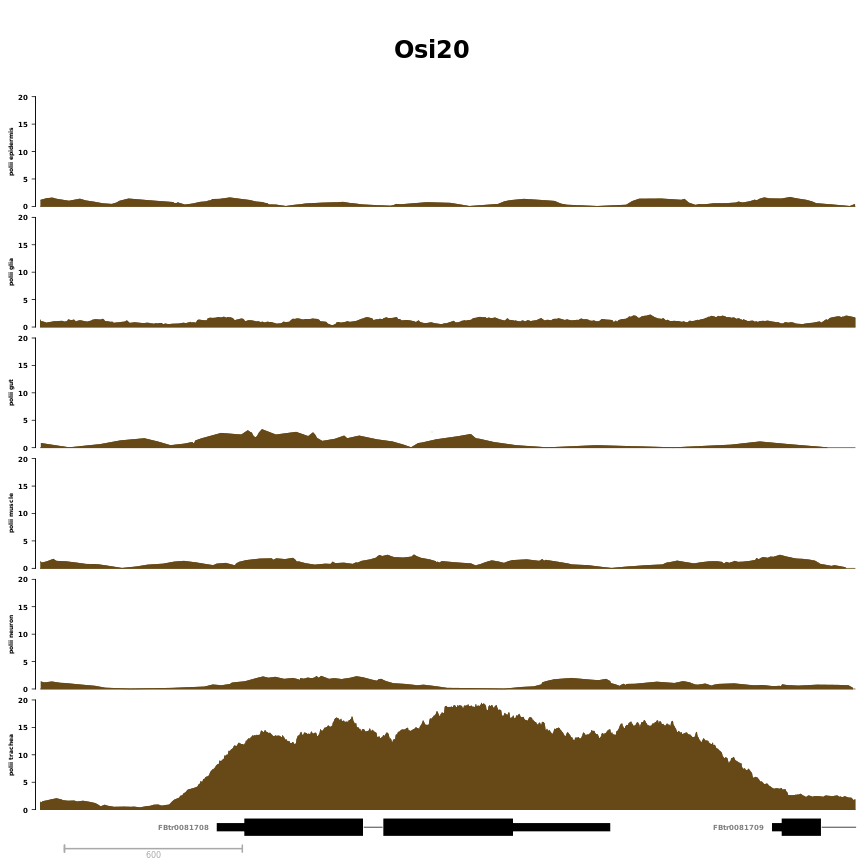
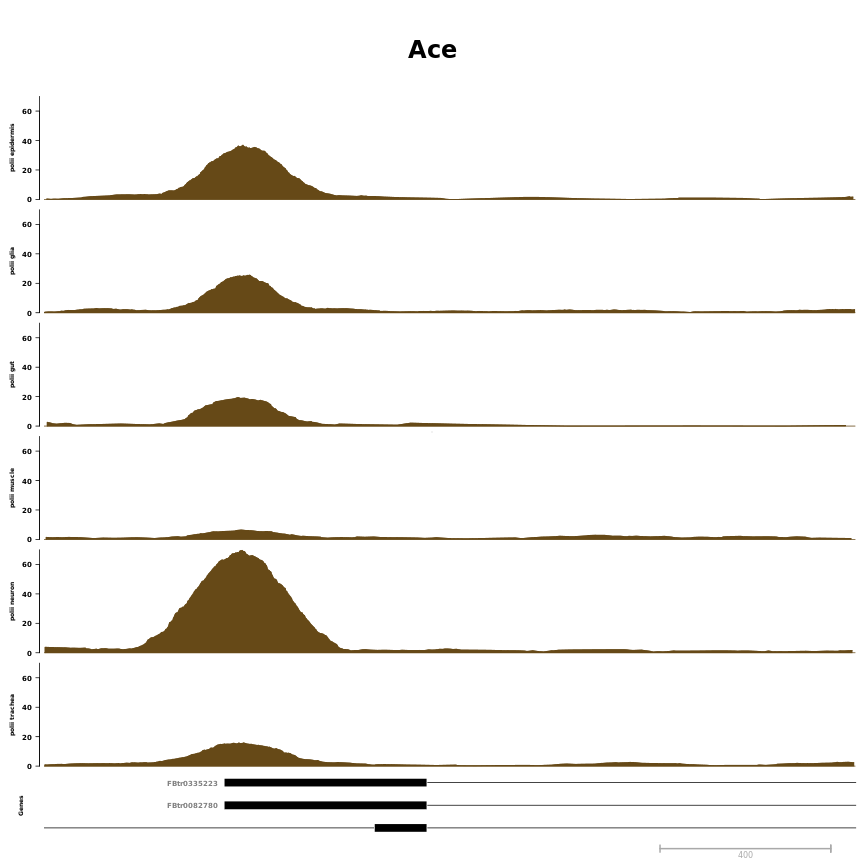
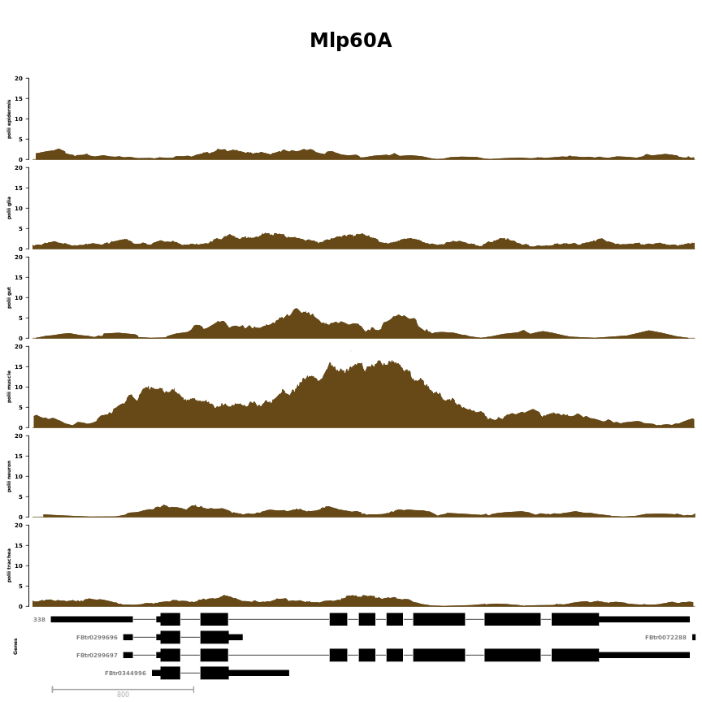

# Single region examples


**Project:** Promoter Opening

**Author:** [Vivek](mailto:vir@stowers.org)

**Generated:** Tue May 29 2018, 09:32 PM


```
## Warning in read.table("data/figure2c_single_gene_tissue_region.csv",
## header = TRUE, : incomplete final line found by readTableHeader on 'data/
## figure2c_single_gene_tissue_region.csv'
```

```
##   seqnames    start      end strand  fb_gene_id fb_gene_symbol limit
## 1    chr3R  6339500  6342250      + FBgn0037430          Osi20    20
## 2    chr3R 13257300 13259200      - FBgn0000024            Ace    70
## 3    chr2R 24074500 24078250      + FBgn0259209         Mlp60A    20
```



```
## [[1]]
## [[1]]$`polii epidermis`
## ReferenceDataTrack 'polii epidermis'
## | genome: dm6
## | active chromosome: chr3R
## | referenced file: ../bw/rpm/Epidermis_7021_INTACT_Rpb3_14-17h_2_rpm.bw
## 
## [[1]]$`polii glia`
## ReferenceDataTrack 'polii glia'
## | genome: dm6
## | active chromosome: chr3R
## | referenced file: ../bw/rpm/Glia_repo_INTACT_Rpb3_14-17h_1_rpm.bw
## 
## [[1]]$`polii gut`
## ReferenceDataTrack 'polii gut'
## | genome: dm6
## | active chromosome: chr3R
## | referenced file: ../bw/rpm/Gut_110394_INTACT_Rpb3_14-17h_1_rpm.bw
## 
## [[1]]$`polii muscle`
## ReferenceDataTrack 'polii muscle'
## | genome: dm6
## | active chromosome: chr3R
## | referenced file: ../bw/rpm/Muscle_mef2_INTACT_Rpb3_14-17h_1_rpm.bw
## 
## [[1]]$`polii neuron`
## ReferenceDataTrack 'polii neuron'
## | genome: dm6
## | active chromosome: chr3R
## | referenced file: ../bw/rpm/Neuron_elav_INTACT_Rpb3_14-17h_1_rpm.bw
## 
## [[1]]$`polii trachea`
## ReferenceDataTrack 'polii trachea'
## | genome: dm6
## | active chromosome: chr3R
## | referenced file: ../bw/rpm/Trachea_8807_INTACT_Rpb3_14-17h_2_rpm.bw
## 
## [[1]]$Genes
## GeneRegionTrack 'Genes'
## | genome: dm6
## | active chromosome: chr3R
## | annotation features: 8
## 
## [[1]]$Axis
## Genome axis 'Axis'
## 
## [[1]]$titles
## An object of class "ImageMap"
## Slot "coords":
##                 x1       y1       x2       y2
## polii epidermis  6  91.2000 37.14081 211.8542
## polii glia       6 211.8542 37.14081 332.5084
## polii gut        6 332.5084 37.14081 453.1626
## polii muscle     6 453.1626 37.14081 573.8168
## polii neuron     6 573.8168 37.14081 694.4710
## polii trachea    6 694.4710 37.14081 815.1252
## Genes            6 815.1252 37.14081 839.2560
## Axis             6 839.2560 37.14081 858.0000
## 
## Slot "tags":
## $title
##   polii epidermis        polii glia         polii gut      polii muscle 
## "polii epidermis"      "polii glia"       "polii gut"    "polii muscle" 
##      polii neuron     polii trachea             Genes              Axis 
##    "polii neuron"   "polii trachea"           "Genes"            "Axis" 
## 
## 
## 
## 
## [[2]]
## [[2]]$`polii epidermis`
## ReferenceDataTrack 'polii epidermis'
## | genome: dm6
## | active chromosome: chr3R
## | referenced file: ../bw/rpm/Epidermis_7021_INTACT_Rpb3_14-17h_2_rpm.bw
## 
## [[2]]$`polii glia`
## ReferenceDataTrack 'polii glia'
## | genome: dm6
## | active chromosome: chr3R
## | referenced file: ../bw/rpm/Glia_repo_INTACT_Rpb3_14-17h_1_rpm.bw
## 
## [[2]]$`polii gut`
## ReferenceDataTrack 'polii gut'
## | genome: dm6
## | active chromosome: chr3R
## | referenced file: ../bw/rpm/Gut_110394_INTACT_Rpb3_14-17h_1_rpm.bw
## 
## [[2]]$`polii muscle`
## ReferenceDataTrack 'polii muscle'
## | genome: dm6
## | active chromosome: chr3R
## | referenced file: ../bw/rpm/Muscle_mef2_INTACT_Rpb3_14-17h_1_rpm.bw
## 
## [[2]]$`polii neuron`
## ReferenceDataTrack 'polii neuron'
## | genome: dm6
## | active chromosome: chr3R
## | referenced file: ../bw/rpm/Neuron_elav_INTACT_Rpb3_14-17h_1_rpm.bw
## 
## [[2]]$`polii trachea`
## ReferenceDataTrack 'polii trachea'
## | genome: dm6
## | active chromosome: chr3R
## | referenced file: ../bw/rpm/Trachea_8807_INTACT_Rpb3_14-17h_2_rpm.bw
## 
## [[2]]$Genes
## GeneRegionTrack 'Genes'
## | genome: dm6
## | active chromosome: chr3R
## | annotation features: 37
## 
## [[2]]$Axis
## Genome axis 'Axis'
## 
## [[2]]$titles
## An object of class "ImageMap"
## Slot "coords":
##                 x1       y1       x2       y2
## polii epidermis  6  91.2000 41.14401 204.5418
## polii glia       6 204.5418 41.14401 317.8836
## polii gut        6 317.8836 41.14401 431.2255
## polii muscle     6 431.2255 41.14401 544.5673
## polii neuron     6 544.5673 41.14401 657.9091
## polii trachea    6 657.9091 41.14401 771.2509
## Genes            6 771.2509 41.14401 839.2560
## Axis             6 839.2560 41.14401 858.0000
## 
## Slot "tags":
## $title
##   polii epidermis        polii glia         polii gut      polii muscle 
## "polii epidermis"      "polii glia"       "polii gut"    "polii muscle" 
##      polii neuron     polii trachea             Genes              Axis 
##    "polii neuron"   "polii trachea"           "Genes"            "Axis" 
## 
## 
## 
## 
## [[3]]
## [[3]]$`polii epidermis`
## ReferenceDataTrack 'polii epidermis'
## | genome: dm6
## | active chromosome: chr2R
## | referenced file: ../bw/rpm/Epidermis_7021_INTACT_Rpb3_14-17h_2_rpm.bw
## 
## [[3]]$`polii glia`
## ReferenceDataTrack 'polii glia'
## | genome: dm6
## | active chromosome: chr2R
## | referenced file: ../bw/rpm/Glia_repo_INTACT_Rpb3_14-17h_1_rpm.bw
## 
## [[3]]$`polii gut`
## ReferenceDataTrack 'polii gut'
## | genome: dm6
## | active chromosome: chr2R
## | referenced file: ../bw/rpm/Gut_110394_INTACT_Rpb3_14-17h_1_rpm.bw
## 
## [[3]]$`polii muscle`
## ReferenceDataTrack 'polii muscle'
## | genome: dm6
## | active chromosome: chr2R
## | referenced file: ../bw/rpm/Muscle_mef2_INTACT_Rpb3_14-17h_1_rpm.bw
## 
## [[3]]$`polii neuron`
## ReferenceDataTrack 'polii neuron'
## | genome: dm6
## | active chromosome: chr2R
## | referenced file: ../bw/rpm/Neuron_elav_INTACT_Rpb3_14-17h_1_rpm.bw
## 
## [[3]]$`polii trachea`
## ReferenceDataTrack 'polii trachea'
## | genome: dm6
## | active chromosome: chr2R
## | referenced file: ../bw/rpm/Trachea_8807_INTACT_Rpb3_14-17h_2_rpm.bw
## 
## [[3]]$Genes
## GeneRegionTrack 'Genes'
## | genome: dm6
## | active chromosome: chr2R
## | annotation features: 35
## 
## [[3]]$Axis
## Genome axis 'Axis'
## 
## [[3]]$titles
## An object of class "ImageMap"
## Slot "coords":
##                 x1       y1       x2       y2
## polii epidermis  6  91.2000 37.14081 201.2082
## polii glia       6 201.2082 37.14081 311.2165
## polii gut        6 311.2165 37.14081 421.2247
## polii muscle     6 421.2247 37.14081 531.2329
## polii neuron     6 531.2329 37.14081 641.2412
## polii trachea    6 641.2412 37.14081 751.2494
## Genes            6 751.2494 37.14081 839.2560
## Axis             6 839.2560 37.14081 858.0000
## 
## Slot "tags":
## $title
##   polii epidermis        polii glia         polii gut      polii muscle 
## "polii epidermis"      "polii glia"       "polii gut"    "polii muscle" 
##      polii neuron     polii trachea             Genes              Axis 
##    "polii neuron"   "polii trachea"           "Genes"            "Axis"
```


## Session information

For reproducibility, this analysis was performed with the following R/Bioconductor session:


```
R version 3.4.4 (2018-03-15)
Platform: x86_64-pc-linux-gnu (64-bit)
Running under: Ubuntu 16.04.4 LTS

Matrix products: default
BLAS: /usr/lib/libblas/libblas.so.3.6.0
LAPACK: /usr/lib/lapack/liblapack.so.3.6.0

locale:
 [1] LC_CTYPE=en_US.UTF-8       LC_NUMERIC=C              
 [3] LC_TIME=en_US.UTF-8        LC_COLLATE=en_US.UTF-8    
 [5] LC_MONETARY=en_US.UTF-8    LC_MESSAGES=en_US.UTF-8   
 [7] LC_PAPER=en_US.UTF-8       LC_NAME=C                 
 [9] LC_ADDRESS=C               LC_TELEPHONE=C            
[11] LC_MEASUREMENT=en_US.UTF-8 LC_IDENTIFICATION=C       

attached base packages:
 [1] grid      stats4    parallel  methods   stats     graphics  grDevices
 [8] utils     datasets  base     

other attached packages:
 [1] bindrcpp_0.2.2                           
 [2] pander_0.6.1                             
 [3] Gviz_1.22.3                              
 [4] dplyr_0.7.4                              
 [5] magrittr_1.5                             
 [6] BSgenome.Dmelanogaster.UCSC.dm6_1.4.1    
 [7] BSgenome_1.46.0                          
 [8] rtracklayer_1.38.3                       
 [9] Biostrings_2.46.0                        
[10] XVector_0.18.0                           
[11] TxDb.Dmelanogaster.UCSC.dm6.ensGene_3.4.1
[12] GenomicFeatures_1.30.3                   
[13] AnnotationDbi_1.40.0                     
[14] Biobase_2.38.0                           
[15] GenomicRanges_1.30.3                     
[16] GenomeInfoDb_1.14.0                      
[17] IRanges_2.12.0                           
[18] S4Vectors_0.16.0                         
[19] BiocGenerics_0.24.0                      
[20] knitr_1.20                               

loaded via a namespace (and not attached):
 [1] ProtGenerics_1.10.0           bitops_1.0-6                 
 [3] matrixStats_0.53.1            bit64_0.9-7                  
 [5] RColorBrewer_1.1-2            progress_1.1.2               
 [7] httr_1.3.1                    tools_3.4.4                  
 [9] backports_1.1.2               R6_2.2.2                     
[11] rpart_4.1-13                  Hmisc_4.1-1                  
[13] DBI_1.0.0                     lazyeval_0.2.1               
[15] colorspace_1.3-2              nnet_7.3-12                  
[17] gridExtra_2.3                 prettyunits_1.0.2            
[19] RMySQL_0.10.15                curl_3.2                     
[21] bit_1.1-13                    compiler_3.4.4               
[23] htmlTable_1.11.2              DelayedArray_0.4.1           
[25] scales_0.5.0                  checkmate_1.8.5              
[27] stringr_1.3.1                 digest_0.6.15                
[29] Rsamtools_1.30.0              foreign_0.8-70               
[31] base64enc_0.1-3               dichromat_2.0-0              
[33] pkgconfig_2.0.1               htmltools_0.3.6              
[35] highr_0.6                     ensembldb_2.2.2              
[37] htmlwidgets_1.2               rlang_0.2.0                  
[39] rstudioapi_0.7                RSQLite_2.1.0                
[41] BiocInstaller_1.28.0          shiny_1.1.0                  
[43] bindr_0.1.1                   BiocParallel_1.12.0          
[45] acepack_1.4.1                 VariantAnnotation_1.24.5     
[47] RCurl_1.95-4.10               GenomeInfoDbData_1.0.0       
[49] Formula_1.2-3                 Matrix_1.2-14                
[51] Rcpp_0.12.16                  munsell_0.4.3                
[53] stringi_1.2.2                 yaml_2.1.19                  
[55] SummarizedExperiment_1.8.1    zlibbioc_1.24.0              
[57] plyr_1.8.4                    AnnotationHub_2.10.1         
[59] blob_1.1.1                    promises_1.0.1               
[61] lattice_0.20-35               splines_3.4.4                
[63] pillar_1.2.2                  biomaRt_2.34.2               
[65] XML_3.98-1.11                 glue_1.2.0                   
[67] evaluate_0.10.1               biovizBase_1.26.0            
[69] latticeExtra_0.6-28           data.table_1.11.2            
[71] httpuv_1.4.3                  gtable_0.2.0                 
[73] assertthat_0.2.0              ggplot2_2.2.1                
[75] mime_0.5                      xtable_1.8-2                 
[77] AnnotationFilter_1.2.0        later_0.7.2                  
[79] survival_2.42-3               tibble_1.4.2                 
[81] GenomicAlignments_1.14.2      memoise_1.1.0                
[83] cluster_2.0.7-1               interactiveDisplayBase_1.16.0
```
