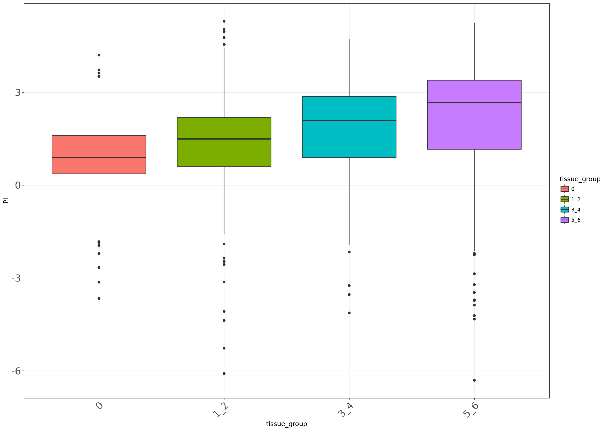
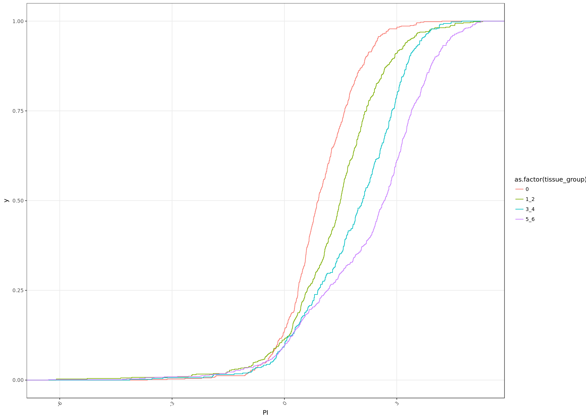

# Calculating PI enrichments


**Project:** Promoter Opening

**Author:** [Vivek](mailto:vir@stowers.org)

**Generated:** Thu May 28 2020, 09:28 PM

## Samples overview

We will calculate the PI using all the four 14-17hrs samples

----------------------------------------------------------------------------------------------------------------------
 label    factor   window   window_upstream   window_downstream              ip                         wce           
-------- -------- -------- ----------------- ------------------- --------------------------- -------------------------
 late_1   polii     tss            0                 200          Dme_emb_Rpb3_14-17h_1.bw    Dme_emb_WCE_14-17h_1.bw 

 late_2   polii     tss            0                 200          Dme_emb_Rpb3_14-17h_2.bw    Dme_emb_WCE_14-17h_2.bw 

 late_1   polii      tu           200                400          Dme_emb_Rpb3_14-17h_1.bw    Dme_emb_WCE_14-17h_1.bw 

 late_2   polii      tu           200                400          Dme_emb_Rpb3_14-17h_2.bw    Dme_emb_WCE_14-17h_2.bw 

 late_1   tfiib     tss          -100                100          Dme_emb_TFIIB_14-17h_1.bw   Dme_emb_WCE_14-17h_1.bw 

 late_2   tfiib     tss          -100                100          Dme_emb_TFIIB_14-17h_2.bw   Dme_emb_WCE_14-17h_2.bw 

 late_1   tfiif     tss          -100                100          Dme_emb_TFIIF_14-17h_1.bw   Dme_emb_WCE_14-17h_1.bw 
----------------------------------------------------------------------------------------------------------------------

## load the samples


## Calculate enrichments

Before calculating enrichment, we floor the WCE signal for each region at the median WCE signal level among all transcripts.


## Save results




```
## 
## 	Wilcoxon rank sum test with continuity correction
## 
## data:  PI_at_late_genes.df %>% filter(tissue_group4 == "0 tissues") %>%  and PI_at_late_genes.df %>% filter(tissue_group4 == "5-6 tissues") %>%     PI$NULL and     PI$NULL
## W = 136240, p-value < 2.2e-16
## alternative hypothesis: true location shift is not equal to 0
```


## Session information

For reproducibility, this analysis was performed with the following R/Bioconductor session:


```
R version 3.4.4 (2018-03-15)
Platform: x86_64-pc-linux-gnu (64-bit)
Running under: Ubuntu 16.04.4 LTS

Matrix products: default
BLAS: /usr/lib/libblas/libblas.so.3.6.0
LAPACK: /usr/lib/lapack/liblapack.so.3.6.0

locale:
 [1] LC_CTYPE=en_US.UTF-8       LC_NUMERIC=C              
 [3] LC_TIME=en_US.UTF-8        LC_COLLATE=en_US.UTF-8    
 [5] LC_MONETARY=en_US.UTF-8    LC_MESSAGES=en_US.UTF-8   
 [7] LC_PAPER=en_US.UTF-8       LC_NAME=C                 
 [9] LC_ADDRESS=C               LC_TELEPHONE=C            
[11] LC_MEASUREMENT=en_US.UTF-8 LC_IDENTIFICATION=C       

attached base packages:
[1] parallel  stats4    stats     graphics  grDevices utils     datasets 
[8] methods   base     

other attached packages:
 [1] bindrcpp_0.2.2                        BSgenome.Dmelanogaster.UCSC.dm6_1.4.1
 [3] BSgenome_1.46.0                       Biostrings_2.46.0                    
 [5] XVector_0.18.0                        rtracklayer_1.38.3                   
 [7] GenomicRanges_1.30.3                  GenomeInfoDb_1.14.0                  
 [9] IRanges_2.12.0                        S4Vectors_0.16.0                     
[11] BiocGenerics_0.24.0                   cowplot_0.9.2                        
[13] ggplot2_2.2.1                         pander_0.6.1                         
[15] magrittr_1.5                          tidyr_0.8.0                          
[17] dplyr_0.7.4                           knitr_1.20                           

loaded via a namespace (and not attached):
 [1] Rcpp_0.12.16               highr_0.6                 
 [3] pillar_1.2.2               compiler_3.4.4            
 [5] plyr_1.8.4                 bindr_0.1.1               
 [7] zlibbioc_1.24.0            bitops_1.0-6              
 [9] tools_3.4.4                digest_0.6.15             
[11] lattice_0.20-35            evaluate_0.10.1           
[13] tibble_1.4.2               gtable_0.2.0              
[15] pkgconfig_2.0.1            rlang_0.2.0               
[17] Matrix_1.2-14              DelayedArray_0.4.1        
[19] GenomeInfoDbData_1.0.0     stringr_1.3.1             
[21] tidyselect_0.2.4           grid_3.4.4                
[23] Biobase_2.38.0             glue_1.2.0                
[25] R6_2.2.2                   BiocParallel_1.12.0       
[27] XML_3.98-1.11              purrr_0.2.4               
[29] matrixStats_0.53.1         GenomicAlignments_1.14.2  
[31] Rsamtools_1.30.0           scales_0.5.0              
[33] SummarizedExperiment_1.8.1 assertthat_0.2.0          
[35] colorspace_1.3-2           labeling_0.3              
[37] stringi_1.2.2              RCurl_1.95-4.10           
[39] lazyeval_0.2.1             munsell_0.4.3             
```
