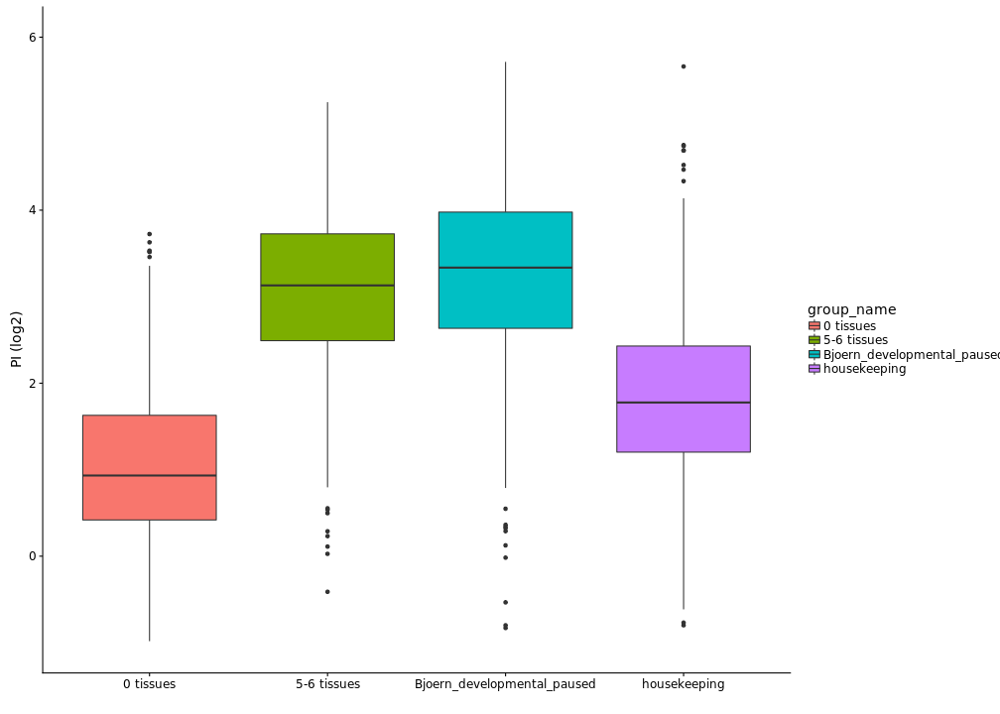
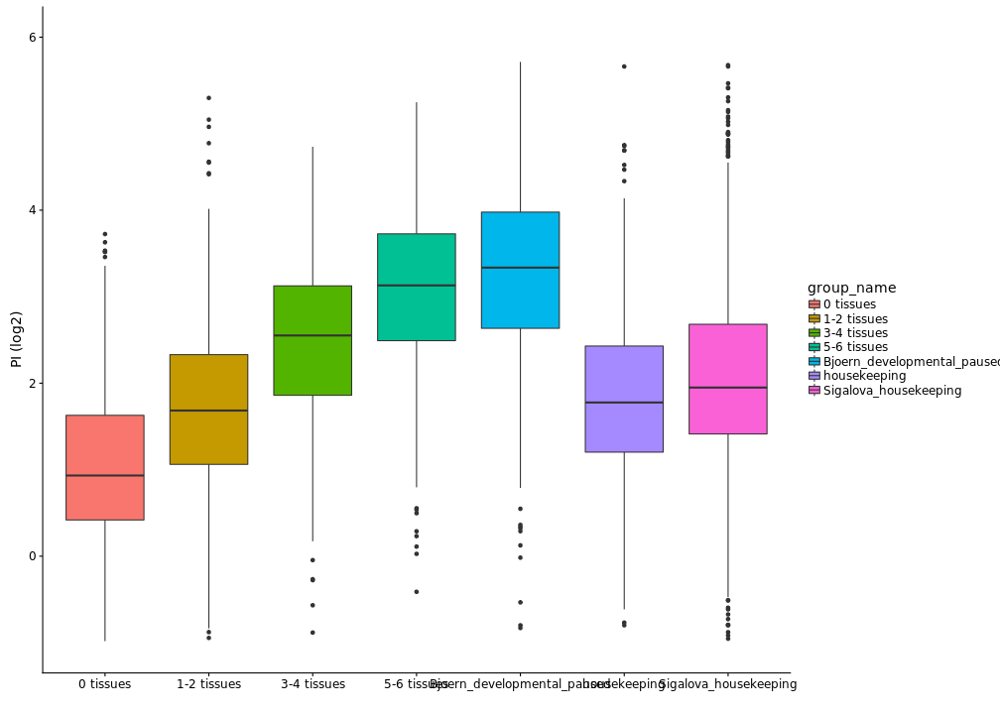
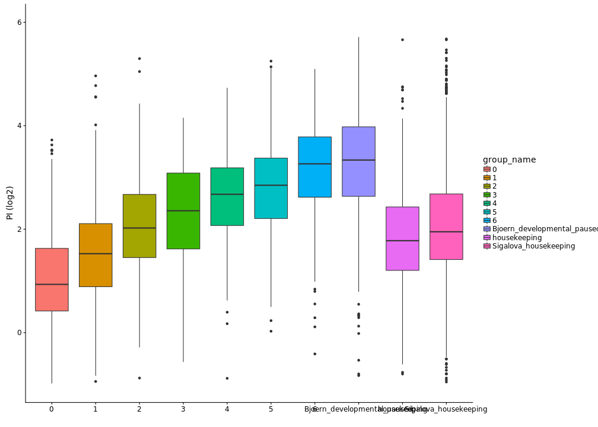

# Calculating PI enrichments


**Project:** Promoter Opening

**Author:** [Vivek](mailto:vir@stowers.org)

**Generated:** Sat Sep 26 2020, 10:33 PM

## Samples overview

We will calculate the PI using all the four 14-17hrs samples

----------------------------------------------------------------------------------------------------------------------
 label    factor   window   window_upstream   window_downstream              ip                         wce           
-------- -------- -------- ----------------- ------------------- --------------------------- -------------------------
 late_1   polii     tss            0                 200          Dme_emb_Rpb3_14-17h_1.bw    Dme_emb_WCE_14-17h_1.bw 

 late_2   polii     tss            0                 200          Dme_emb_Rpb3_14-17h_2.bw    Dme_emb_WCE_14-17h_2.bw 

 late_1   polii      tu           200                400          Dme_emb_Rpb3_14-17h_1.bw    Dme_emb_WCE_14-17h_1.bw 

 late_2   polii      tu           200                400          Dme_emb_Rpb3_14-17h_2.bw    Dme_emb_WCE_14-17h_2.bw 

 late_1   tfiib     tss          -100                100          Dme_emb_TFIIB_14-17h_1.bw   Dme_emb_WCE_14-17h_1.bw 

 late_2   tfiib     tss          -100                100          Dme_emb_TFIIB_14-17h_2.bw   Dme_emb_WCE_14-17h_2.bw 

 late_1   tfiif     tss          -100                100          Dme_emb_TFIIF_14-17h_1.bw   Dme_emb_WCE_14-17h_1.bw 
----------------------------------------------------------------------------------------------------------------------

## load the samples


## Calculate enrichments

Before calculating enrichment, we floor the WCE signal for each region at the median WCE signal level among all transcripts.


## Save results


## Plot the results

```
## Warning: Removed 12 rows containing non-finite values (stat_boxplot).
```



```
## Warning: Removed 24 rows containing non-finite values (stat_boxplot).
```



```
## Warning: Removed 24 rows containing non-finite values (stat_boxplot).
```


## Stats


## Session information

For reproducibility, this analysis was performed with the following R/Bioconductor session:


```
R version 3.4.4 (2018-03-15)
Platform: x86_64-pc-linux-gnu (64-bit)
Running under: Ubuntu 16.04.4 LTS

Matrix products: default
BLAS: /usr/lib/libblas/libblas.so.3.6.0
LAPACK: /usr/lib/lapack/liblapack.so.3.6.0

locale:
 [1] LC_CTYPE=en_US.UTF-8       LC_NUMERIC=C              
 [3] LC_TIME=en_US.UTF-8        LC_COLLATE=en_US.UTF-8    
 [5] LC_MONETARY=en_US.UTF-8    LC_MESSAGES=en_US.UTF-8   
 [7] LC_PAPER=en_US.UTF-8       LC_NAME=C                 
 [9] LC_ADDRESS=C               LC_TELEPHONE=C            
[11] LC_MEASUREMENT=en_US.UTF-8 LC_IDENTIFICATION=C       

attached base packages:
[1] parallel  stats4    stats     graphics  grDevices utils     datasets 
[8] methods   base     

other attached packages:
 [1] BSgenome.Dmelanogaster.UCSC.dm6_1.4.1 BSgenome_1.46.0                      
 [3] Biostrings_2.46.0                     XVector_0.18.0                       
 [5] rtracklayer_1.38.3                    GenomicRanges_1.30.3                 
 [7] GenomeInfoDb_1.14.0                   IRanges_2.12.0                       
 [9] S4Vectors_0.16.0                      BiocGenerics_0.24.0                  
[11] cowplot_0.9.2                         ggplot2_2.2.1                        
[13] pander_0.6.1                          magrittr_1.5                         
[15] tidyr_0.8.0                           dplyr_1.0.2                          

loaded via a namespace (and not attached):
 [1] Rcpp_0.12.16               highr_0.6                 
 [3] pillar_1.4.6               compiler_3.4.4            
 [5] plyr_1.8.4                 zlibbioc_1.24.0           
 [7] bitops_1.0-6               tools_3.4.4               
 [9] digest_0.6.25              lattice_0.20-35           
[11] evaluate_0.14              lifecycle_0.2.0           
[13] tibble_3.0.3               gtable_0.3.0              
[15] pkgconfig_2.0.3            rlang_0.4.7               
[17] Matrix_1.2-14              DelayedArray_0.4.1        
[19] GenomeInfoDbData_1.0.0     stringr_1.3.1             
[21] knitr_1.20                 generics_0.0.2            
[23] vctrs_0.3.3                grid_3.4.4                
[25] tidyselect_1.1.0           Biobase_2.38.0            
[27] glue_1.4.2                 R6_2.4.1                  
[29] BiocParallel_1.12.0        XML_3.98-1.11             
[31] farver_2.0.3               purrr_0.3.4               
[33] matrixStats_0.53.1         GenomicAlignments_1.14.2  
[35] Rsamtools_1.30.0           scales_1.1.1              
[37] ellipsis_0.3.1             SummarizedExperiment_1.8.1
[39] colorspace_1.4-1           labeling_0.3              
[41] stringi_1.2.2              RCurl_1.95-4.10           
[43] lazyeval_0.2.1             munsell_0.5.0             
[45] crayon_1.3.4              
```
