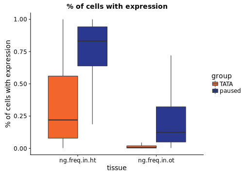
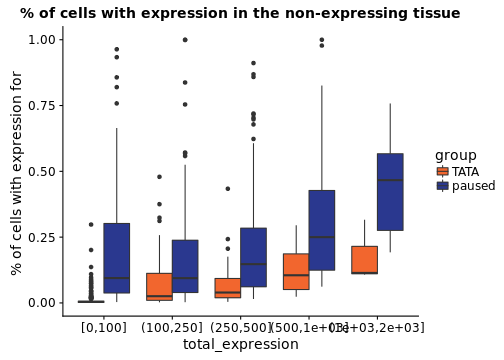
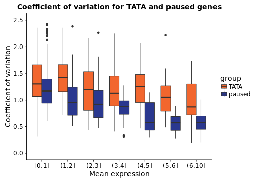

Look at changes in gene expression of Tata and paused genes in the single cell data


**Project:** Promoter Opening

**Author:** [Vivek](mailto:vir@stowers.org)

**Generated:** Mon Jun 01 2020, 12:02 AM




```
## 
## 	Pairwise comparisons using Wilcoxon rank sum test 
## 
## data:  .$value and .$group 
## 
##        TATA  
## paused <2e-16
## 
## P value adjustment method: holm
```

```
## 
## 	Pairwise comparisons using Wilcoxon rank sum test 
## 
## data:  .$value and .$group 
## 
##        TATA  
## paused <2e-16
## 
## P value adjustment method: holm
```




```
## Warning: Removed 34 rows containing non-finite values (stat_boxplot).
```




## Session information

For reproducibility, this analysis was performed with the following R/Bioconductor session:


```
R version 3.4.4 (2018-03-15)
Platform: x86_64-pc-linux-gnu (64-bit)
Running under: Ubuntu 16.04.4 LTS

Matrix products: default
BLAS: /usr/lib/libblas/libblas.so.3.6.0
LAPACK: /usr/lib/lapack/liblapack.so.3.6.0

locale:
 [1] LC_CTYPE=en_US.UTF-8       LC_NUMERIC=C              
 [3] LC_TIME=en_US.UTF-8        LC_COLLATE=en_US.UTF-8    
 [5] LC_MONETARY=en_US.UTF-8    LC_MESSAGES=en_US.UTF-8   
 [7] LC_PAPER=en_US.UTF-8       LC_NAME=C                 
 [9] LC_ADDRESS=C               LC_TELEPHONE=C            
[11] LC_MEASUREMENT=en_US.UTF-8 LC_IDENTIFICATION=C       

attached base packages:
[1] parallel  stats4    methods   stats     graphics  grDevices utils    
[8] datasets  base     

other attached packages:
 [1] bindrcpp_0.2.2                        BSgenome.Dmelanogaster.UCSC.dm6_1.4.1
 [3] BSgenome_1.46.0                       Biostrings_2.46.0                    
 [5] XVector_0.18.0                        rtracklayer_1.38.3                   
 [7] GenomicRanges_1.30.3                  GenomeInfoDb_1.14.0                  
 [9] IRanges_2.12.0                        S4Vectors_0.16.0                     
[11] BiocGenerics_0.24.0                   pander_0.6.1                         
[13] RColorBrewer_1.1-2                    magrittr_1.5                         
[15] dplyr_0.7.4                           tidyr_0.8.0                          
[17] Seurat_2.3.1                          Matrix_1.2-14                        
[19] cowplot_0.9.2                         ggplot2_2.2.1                        
[21] knitr_1.20                           

loaded via a namespace (and not attached):
  [1] snow_0.4-2                 backports_1.1.2           
  [3] Hmisc_4.1-1                VGAM_1.0-5                
  [5] sn_1.5-2                   plyr_1.8.4                
  [7] igraph_1.2.1               lazyeval_0.2.1            
  [9] splines_3.4.4              BiocParallel_1.12.0       
 [11] digest_0.6.15              foreach_1.4.4             
 [13] htmltools_0.3.6            lars_1.2                  
 [15] gdata_2.18.0               checkmate_1.8.5           
 [17] cluster_2.0.7-1            mixtools_1.1.0            
 [19] ROCR_1.0-7                 sfsmisc_1.1-2             
 [21] recipes_0.1.2              gower_0.1.2               
 [23] matrixStats_0.53.1         dimRed_0.1.0              
 [25] R.utils_2.6.0              colorspace_1.3-2          
 [27] RCurl_1.95-4.10            jsonlite_1.5              
 [29] bindr_0.1.1                survival_2.42-3           
 [31] zoo_1.8-1                  iterators_1.0.9           
 [33] ape_5.1                    glue_1.2.0                
 [35] DRR_0.0.3                  gtable_0.2.0              
 [37] zlibbioc_1.24.0            ipred_0.9-6               
 [39] DelayedArray_0.4.1         kernlab_0.9-26            
 [41] ddalpha_1.3.3              prabclus_2.2-6            
 [43] DEoptimR_1.0-8             abind_1.4-5               
 [45] scales_0.5.0               mvtnorm_1.0-7             
 [47] Rcpp_0.12.16               metap_0.9                 
 [49] dtw_1.18-1                 htmlTable_1.11.2          
 [51] magic_1.5-8                tclust_1.3-1              
 [53] reticulate_1.7             foreign_0.8-70            
 [55] proxy_0.4-22               mclust_5.4                
 [57] SDMTools_1.1-221           Formula_1.2-3             
 [59] tsne_0.1-3                 lava_1.6.1                
 [61] prodlim_2018.04.18         htmlwidgets_1.2           
 [63] FNN_1.1                    gplots_3.0.1              
 [65] fpc_2.1-11                 acepack_1.4.1             
 [67] modeltools_0.2-21          ica_1.0-1                 
 [69] XML_3.98-1.11              pkgconfig_2.0.1           
 [71] R.methodsS3_1.7.1          flexmix_2.3-14            
 [73] nnet_7.3-12                caret_6.0-79              
 [75] labeling_0.3               tidyselect_0.2.4          
 [77] rlang_0.2.0                reshape2_1.4.3            
 [79] munsell_0.4.3              tools_3.4.4               
 [81] ranger_0.9.0               broom_0.4.4               
 [83] ggridges_0.5.0             evaluate_0.10.1           
 [85] geometry_0.3-6             stringr_1.3.1             
 [87] ModelMetrics_1.1.0         fitdistrplus_1.0-9        
 [89] robustbase_0.93-0          caTools_1.17.1            
 [91] purrr_0.2.4                RANN_2.5.1                
 [93] pbapply_1.3-4              nlme_3.1-137              
 [95] R.oo_1.22.0                RcppRoll_0.2.2            
 [97] compiler_3.4.4             rstudioapi_0.7            
 [99] png_0.1-7                  tibble_1.4.2              
[101] stringi_1.2.2              highr_0.6                 
[103] lattice_0.20-35            trimcluster_0.1-2         
[105] psych_1.8.4                diffusionMap_1.1-0        
[107] pillar_1.2.2               lmtest_0.9-36             
[109] data.table_1.11.2          bitops_1.0-6              
[111] irlba_2.3.2                R6_2.2.2                  
[113] latticeExtra_0.6-28        KernSmooth_2.23-15        
[115] gridExtra_2.3              codetools_0.2-15          
[117] MASS_7.3-50                gtools_3.5.0              
[119] assertthat_0.2.0           SummarizedExperiment_1.8.1
[121] CVST_0.2-1                 withr_2.1.2               
[123] GenomicAlignments_1.14.2   Rsamtools_1.30.0          
[125] mnormt_1.5-5               GenomeInfoDbData_1.0.0    
[127] diptest_0.75-7             doSNOW_1.0.16             
[129] grid_3.4.4                 rpart_4.1-13              
[131] timeDate_3043.102          class_7.3-14              
[133] segmented_0.5-3.0          Rtsne_0.13                
[135] Biobase_2.38.0             numDeriv_2016.8-1         
[137] scatterplot3d_0.3-41       lubridate_1.7.4           
[139] base64enc_0.1-3           
```
