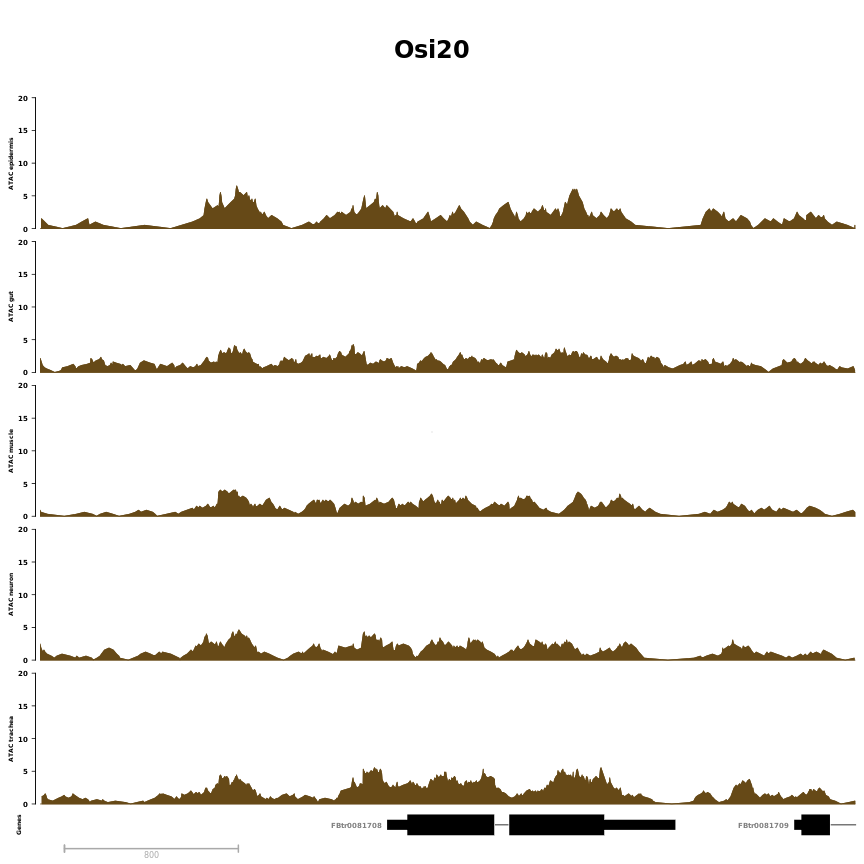
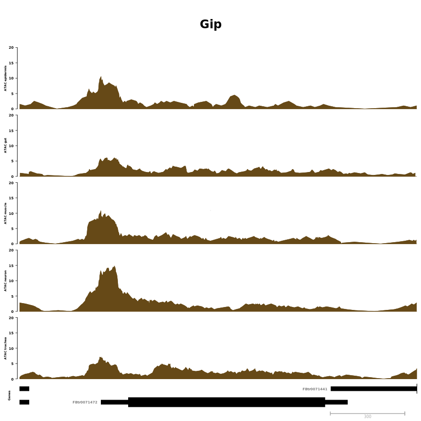
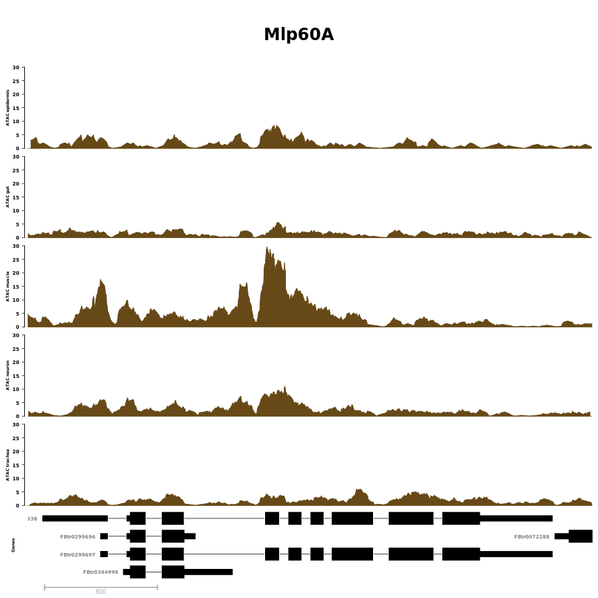
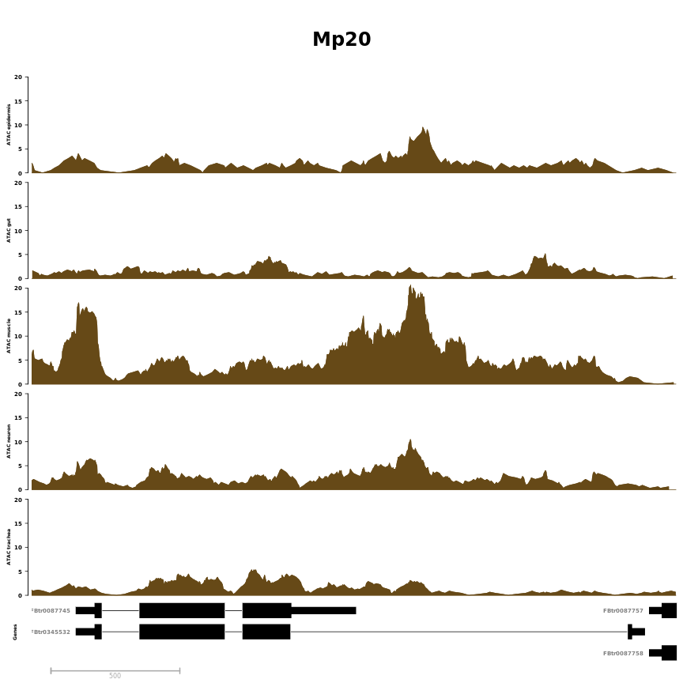
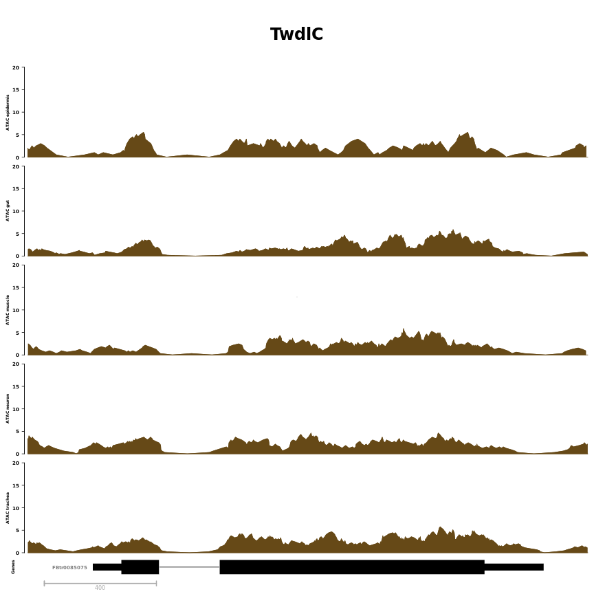
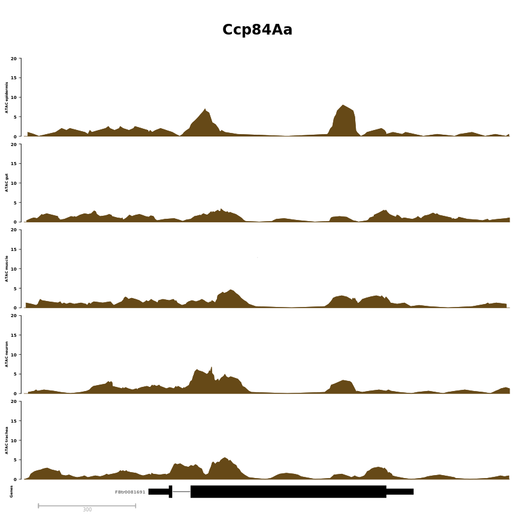
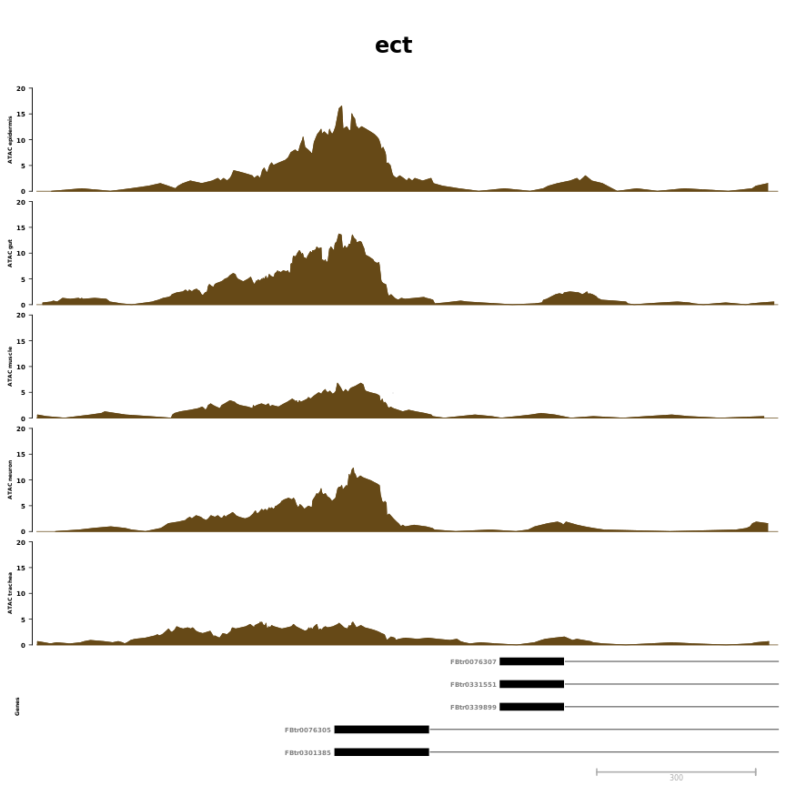

# Single region examples


**Project:** Promoter Opening

**Author:** [Vivek](mailto:vir@stowers.org)

**Generated:** Mon Sep 24 2018, 06:57 PM


```
##   seqnames    start      end strand  fb_gene_id fb_gene_symbol limit
## 1    chr3R  6338500  6342250      + FBgn0037430          Osi20    20
## 2     chrX 10328600 10330200      - FBgn0011770            Gip    20
## 3    chr2R 24074500 24078500      + FBgn0259209         Mlp60A    30
## 4    chr2R 13246500 13249000      + FBgn0002789           Mp20    20
## 5    chr3R 26994600 26996600      + FBgn0039469          TwdlC    20
## 6    chr3R  6703700  6705200      + FBgn0004783        Ccp84Aa    20
## 7    chr3L 10201000 10202400      - FBgn0000451            ect    20
```



```
## [[1]]
## [[1]]$`ATAC epidermis`
## ReferenceDataTrack 'ATAC epidermis'
## | genome: dm6
## | active chromosome: chr3R
## | referenced file: ../bw/rpm/Epidermis_7021_INTACT_14_17h_ATAC_1.bam_from0to100_rpm.bw
## 
## [[1]]$`ATAC gut`
## ReferenceDataTrack 'ATAC gut'
## | genome: dm6
## | active chromosome: chr3R
## | referenced file: ../bw/rpm/Gut_INTACT_14_17h_ATAC_1.bam_from0to100_rpm.bw
## 
## [[1]]$`ATAC muscle`
## ReferenceDataTrack 'ATAC muscle'
## | genome: dm6
## | active chromosome: chr3R
## | referenced file: ../bw/rpm/Muscle_mef2_INTACT_14_17h_ATAC_1.bam_from0to100_rpm.bw
## 
## [[1]]$`ATAC neuron`
## ReferenceDataTrack 'ATAC neuron'
## | genome: dm6
## | active chromosome: chr3R
## | referenced file: ../bw/rpm/Neuron_elav_INTACT_14_17h_ATAC_1.bam_from0to100_rpm.bw
## 
## [[1]]$`ATAC trachea`
## ReferenceDataTrack 'ATAC trachea'
## | genome: dm6
## | active chromosome: chr3R
## | referenced file: ../bw/rpm/Trachea_INTACT_14_17h_ATAC_1.bam_from0to100_rpm.bw
## 
## [[1]]$Genes
## GeneRegionTrack 'Genes'
## | genome: dm6
## | active chromosome: chr3R
## | annotation features: 8
## 
## [[1]]$Axis
## Genome axis 'Axis'
## 
## [[1]]$titles
## An object of class "ImageMap"
## Slot "coords":
##                x1       y1       x2       y2
## ATAC epidermis  6  91.2000 37.14081 235.0569
## ATAC gut        6 235.0569 37.14081 378.9138
## ATAC muscle     6 378.9138 37.14081 522.7708
## ATAC neuron     6 522.7708 37.14081 666.6277
## ATAC trachea    6 666.6277 37.14081 810.4846
## Genes           6 810.4846 37.14081 839.2560
## Axis            6 839.2560 37.14081 858.0000
## 
## Slot "tags":
## $title
##   ATAC epidermis         ATAC gut      ATAC muscle      ATAC neuron 
## "ATAC epidermis"       "ATAC gut"    "ATAC muscle"    "ATAC neuron" 
##     ATAC trachea            Genes             Axis 
##   "ATAC trachea"          "Genes"           "Axis" 
## 
## 
## 
## 
## [[2]]
## [[2]]$`ATAC epidermis`
## ReferenceDataTrack 'ATAC epidermis'
## | genome: dm6
## | active chromosome: chrX
## | referenced file: ../bw/rpm/Epidermis_7021_INTACT_14_17h_ATAC_1.bam_from0to100_rpm.bw
## 
## [[2]]$`ATAC gut`
## ReferenceDataTrack 'ATAC gut'
## | genome: dm6
## | active chromosome: chrX
## | referenced file: ../bw/rpm/Gut_INTACT_14_17h_ATAC_1.bam_from0to100_rpm.bw
## 
## [[2]]$`ATAC muscle`
## ReferenceDataTrack 'ATAC muscle'
## | genome: dm6
## | active chromosome: chrX
## | referenced file: ../bw/rpm/Muscle_mef2_INTACT_14_17h_ATAC_1.bam_from0to100_rpm.bw
## 
## [[2]]$`ATAC neuron`
## ReferenceDataTrack 'ATAC neuron'
## | genome: dm6
## | active chromosome: chrX
## | referenced file: ../bw/rpm/Neuron_elav_INTACT_14_17h_ATAC_1.bam_from0to100_rpm.bw
## 
## [[2]]$`ATAC trachea`
## ReferenceDataTrack 'ATAC trachea'
## | genome: dm6
## | active chromosome: chrX
## | referenced file: ../bw/rpm/Trachea_INTACT_14_17h_ATAC_1.bam_from0to100_rpm.bw
## 
## [[2]]$Genes
## GeneRegionTrack 'Genes'
## | genome: dm6
## | active chromosome: chrX
## | annotation features: 17
## 
## [[2]]$Axis
## Genome axis 'Axis'
## 
## [[2]]$titles
## An object of class "ImageMap"
## Slot "coords":
##                x1       y1       x2       y2
## ATAC epidermis  6  91.2000 37.14081 229.7289
## ATAC gut        6 229.7289 37.14081 368.2578
## ATAC muscle     6 368.2578 37.14081 506.7867
## ATAC neuron     6 506.7867 37.14081 645.3156
## ATAC trachea    6 645.3156 37.14081 783.8444
## Genes           6 783.8444 37.14081 839.2560
## Axis            6 839.2560 37.14081 858.0000
## 
## Slot "tags":
## $title
##   ATAC epidermis         ATAC gut      ATAC muscle      ATAC neuron 
## "ATAC epidermis"       "ATAC gut"    "ATAC muscle"    "ATAC neuron" 
##     ATAC trachea            Genes             Axis 
##   "ATAC trachea"          "Genes"           "Axis" 
## 
## 
## 
## 
## [[3]]
## [[3]]$`ATAC epidermis`
## ReferenceDataTrack 'ATAC epidermis'
## | genome: dm6
## | active chromosome: chr2R
## | referenced file: ../bw/rpm/Epidermis_7021_INTACT_14_17h_ATAC_1.bam_from0to100_rpm.bw
## 
## [[3]]$`ATAC gut`
## ReferenceDataTrack 'ATAC gut'
## | genome: dm6
## | active chromosome: chr2R
## | referenced file: ../bw/rpm/Gut_INTACT_14_17h_ATAC_1.bam_from0to100_rpm.bw
## 
## [[3]]$`ATAC muscle`
## ReferenceDataTrack 'ATAC muscle'
## | genome: dm6
## | active chromosome: chr2R
## | referenced file: ../bw/rpm/Muscle_mef2_INTACT_14_17h_ATAC_1.bam_from0to100_rpm.bw
## 
## [[3]]$`ATAC neuron`
## ReferenceDataTrack 'ATAC neuron'
## | genome: dm6
## | active chromosome: chr2R
## | referenced file: ../bw/rpm/Neuron_elav_INTACT_14_17h_ATAC_1.bam_from0to100_rpm.bw
## 
## [[3]]$`ATAC trachea`
## ReferenceDataTrack 'ATAC trachea'
## | genome: dm6
## | active chromosome: chr2R
## | referenced file: ../bw/rpm/Trachea_INTACT_14_17h_ATAC_1.bam_from0to100_rpm.bw
## 
## [[3]]$Genes
## GeneRegionTrack 'Genes'
## | genome: dm6
## | active chromosome: chr2R
## | annotation features: 35
## 
## [[3]]$Axis
## Genome axis 'Axis'
## 
## [[3]]$titles
## An object of class "ImageMap"
## Slot "coords":
##                x1       y1       x2       y2
## ATAC epidermis  6  91.2000 37.14081 220.1752
## ATAC gut        6 220.1752 37.14081 349.1503
## ATAC muscle     6 349.1503 37.14081 478.1255
## ATAC neuron     6 478.1255 37.14081 607.1007
## ATAC trachea    6 607.1007 37.14081 736.0759
## Genes           6 736.0759 37.14081 839.2560
## Axis            6 839.2560 37.14081 858.0000
## 
## Slot "tags":
## $title
##   ATAC epidermis         ATAC gut      ATAC muscle      ATAC neuron 
## "ATAC epidermis"       "ATAC gut"    "ATAC muscle"    "ATAC neuron" 
##     ATAC trachea            Genes             Axis 
##   "ATAC trachea"          "Genes"           "Axis" 
## 
## 
## 
## 
## [[4]]
## [[4]]$`ATAC epidermis`
## ReferenceDataTrack 'ATAC epidermis'
## | genome: dm6
## | active chromosome: chr2R
## | referenced file: ../bw/rpm/Epidermis_7021_INTACT_14_17h_ATAC_1.bam_from0to100_rpm.bw
## 
## [[4]]$`ATAC gut`
## ReferenceDataTrack 'ATAC gut'
## | genome: dm6
## | active chromosome: chr2R
## | referenced file: ../bw/rpm/Gut_INTACT_14_17h_ATAC_1.bam_from0to100_rpm.bw
## 
## [[4]]$`ATAC muscle`
## ReferenceDataTrack 'ATAC muscle'
## | genome: dm6
## | active chromosome: chr2R
## | referenced file: ../bw/rpm/Muscle_mef2_INTACT_14_17h_ATAC_1.bam_from0to100_rpm.bw
## 
## [[4]]$`ATAC neuron`
## ReferenceDataTrack 'ATAC neuron'
## | genome: dm6
## | active chromosome: chr2R
## | referenced file: ../bw/rpm/Neuron_elav_INTACT_14_17h_ATAC_1.bam_from0to100_rpm.bw
## 
## [[4]]$`ATAC trachea`
## ReferenceDataTrack 'ATAC trachea'
## | genome: dm6
## | active chromosome: chr2R
## | referenced file: ../bw/rpm/Trachea_INTACT_14_17h_ATAC_1.bam_from0to100_rpm.bw
## 
## [[4]]$Genes
## GeneRegionTrack 'Genes'
## | genome: dm6
## | active chromosome: chr2R
## | annotation features: 22
## 
## [[4]]$Axis
## Genome axis 'Axis'
## 
## [[4]]$titles
## An object of class "ImageMap"
## Slot "coords":
##                x1       y1       x2       y2
## ATAC epidermis  6  91.2000 37.14081 224.7814
## ATAC gut        6 224.7814 37.14081 358.3629
## ATAC muscle     6 358.3629 37.14081 491.9443
## ATAC neuron     6 491.9443 37.14081 625.5257
## ATAC trachea    6 625.5257 37.14081 759.1071
## Genes           6 759.1071 37.14081 839.2560
## Axis            6 839.2560 37.14081 858.0000
## 
## Slot "tags":
## $title
##   ATAC epidermis         ATAC gut      ATAC muscle      ATAC neuron 
## "ATAC epidermis"       "ATAC gut"    "ATAC muscle"    "ATAC neuron" 
##     ATAC trachea            Genes             Axis 
##   "ATAC trachea"          "Genes"           "Axis" 
## 
## 
## 
## 
## [[5]]
## [[5]]$`ATAC epidermis`
## ReferenceDataTrack 'ATAC epidermis'
## | genome: dm6
## | active chromosome: chr3R
## | referenced file: ../bw/rpm/Epidermis_7021_INTACT_14_17h_ATAC_1.bam_from0to100_rpm.bw
## 
## [[5]]$`ATAC gut`
## ReferenceDataTrack 'ATAC gut'
## | genome: dm6
## | active chromosome: chr3R
## | referenced file: ../bw/rpm/Gut_INTACT_14_17h_ATAC_1.bam_from0to100_rpm.bw
## 
## [[5]]$`ATAC muscle`
## ReferenceDataTrack 'ATAC muscle'
## | genome: dm6
## | active chromosome: chr3R
## | referenced file: ../bw/rpm/Muscle_mef2_INTACT_14_17h_ATAC_1.bam_from0to100_rpm.bw
## 
## [[5]]$`ATAC neuron`
## ReferenceDataTrack 'ATAC neuron'
## | genome: dm6
## | active chromosome: chr3R
## | referenced file: ../bw/rpm/Neuron_elav_INTACT_14_17h_ATAC_1.bam_from0to100_rpm.bw
## 
## [[5]]$`ATAC trachea`
## ReferenceDataTrack 'ATAC trachea'
## | genome: dm6
## | active chromosome: chr3R
## | referenced file: ../bw/rpm/Trachea_INTACT_14_17h_ATAC_1.bam_from0to100_rpm.bw
## 
## [[5]]$Genes
## GeneRegionTrack 'Genes'
## | genome: dm6
## | active chromosome: chr3R
## | annotation features: 4
## 
## [[5]]$Axis
## Genome axis 'Axis'
## 
## [[5]]$titles
## An object of class "ImageMap"
## Slot "coords":
##                x1       y1       x2       y2
## ATAC epidermis  6  91.2000 37.14081 235.0569
## ATAC gut        6 235.0569 37.14081 378.9138
## ATAC muscle     6 378.9138 37.14081 522.7708
## ATAC neuron     6 522.7708 37.14081 666.6277
## ATAC trachea    6 666.6277 37.14081 810.4846
## Genes           6 810.4846 37.14081 839.2560
## Axis            6 839.2560 37.14081 858.0000
## 
## Slot "tags":
## $title
##   ATAC epidermis         ATAC gut      ATAC muscle      ATAC neuron 
## "ATAC epidermis"       "ATAC gut"    "ATAC muscle"    "ATAC neuron" 
##     ATAC trachea            Genes             Axis 
##   "ATAC trachea"          "Genes"           "Axis" 
## 
## 
## 
## 
## [[6]]
## [[6]]$`ATAC epidermis`
## ReferenceDataTrack 'ATAC epidermis'
## | genome: dm6
## | active chromosome: chr3R
## | referenced file: ../bw/rpm/Epidermis_7021_INTACT_14_17h_ATAC_1.bam_from0to100_rpm.bw
## 
## [[6]]$`ATAC gut`
## ReferenceDataTrack 'ATAC gut'
## | genome: dm6
## | active chromosome: chr3R
## | referenced file: ../bw/rpm/Gut_INTACT_14_17h_ATAC_1.bam_from0to100_rpm.bw
## 
## [[6]]$`ATAC muscle`
## ReferenceDataTrack 'ATAC muscle'
## | genome: dm6
## | active chromosome: chr3R
## | referenced file: ../bw/rpm/Muscle_mef2_INTACT_14_17h_ATAC_1.bam_from0to100_rpm.bw
## 
## [[6]]$`ATAC neuron`
## ReferenceDataTrack 'ATAC neuron'
## | genome: dm6
## | active chromosome: chr3R
## | referenced file: ../bw/rpm/Neuron_elav_INTACT_14_17h_ATAC_1.bam_from0to100_rpm.bw
## 
## [[6]]$`ATAC trachea`
## ReferenceDataTrack 'ATAC trachea'
## | genome: dm6
## | active chromosome: chr3R
## | referenced file: ../bw/rpm/Trachea_INTACT_14_17h_ATAC_1.bam_from0to100_rpm.bw
## 
## [[6]]$Genes
## GeneRegionTrack 'Genes'
## | genome: dm6
## | active chromosome: chr3R
## | annotation features: 4
## 
## [[6]]$Axis
## Genome axis 'Axis'
## 
## [[6]]$titles
## An object of class "ImageMap"
## Slot "coords":
##                x1       y1       x2       y2
## ATAC epidermis  6  91.2000 37.14081 235.0569
## ATAC gut        6 235.0569 37.14081 378.9138
## ATAC muscle     6 378.9138 37.14081 522.7708
## ATAC neuron     6 522.7708 37.14081 666.6277
## ATAC trachea    6 666.6277 37.14081 810.4846
## Genes           6 810.4846 37.14081 839.2560
## Axis            6 839.2560 37.14081 858.0000
## 
## Slot "tags":
## $title
##   ATAC epidermis         ATAC gut      ATAC muscle      ATAC neuron 
## "ATAC epidermis"       "ATAC gut"    "ATAC muscle"    "ATAC neuron" 
##     ATAC trachea            Genes             Axis 
##   "ATAC trachea"          "Genes"           "Axis" 
## 
## 
## 
## 
## [[7]]
## [[7]]$`ATAC epidermis`
## ReferenceDataTrack 'ATAC epidermis'
## | genome: dm6
## | active chromosome: chr3L
## | referenced file: ../bw/rpm/Epidermis_7021_INTACT_14_17h_ATAC_1.bam_from0to100_rpm.bw
## 
## [[7]]$`ATAC gut`
## ReferenceDataTrack 'ATAC gut'
## | genome: dm6
## | active chromosome: chr3L
## | referenced file: ../bw/rpm/Gut_INTACT_14_17h_ATAC_1.bam_from0to100_rpm.bw
## 
## [[7]]$`ATAC muscle`
## ReferenceDataTrack 'ATAC muscle'
## | genome: dm6
## | active chromosome: chr3L
## | referenced file: ../bw/rpm/Muscle_mef2_INTACT_14_17h_ATAC_1.bam_from0to100_rpm.bw
## 
## [[7]]$`ATAC neuron`
## ReferenceDataTrack 'ATAC neuron'
## | genome: dm6
## | active chromosome: chr3L
## | referenced file: ../bw/rpm/Neuron_elav_INTACT_14_17h_ATAC_1.bam_from0to100_rpm.bw
## 
## [[7]]$`ATAC trachea`
## ReferenceDataTrack 'ATAC trachea'
## | genome: dm6
## | active chromosome: chr3L
## | referenced file: ../bw/rpm/Trachea_INTACT_14_17h_ATAC_1.bam_from0to100_rpm.bw
## 
## [[7]]$Genes
## GeneRegionTrack 'Genes'
## | genome: dm6
## | active chromosome: chr3L
## | annotation features: 46
## 
## [[7]]$Axis
## Genome axis 'Axis'
## 
## [[7]]$titles
## An object of class "ImageMap"
## Slot "coords":
##                x1      y1       x2      y2
## ATAC epidermis  6  91.200 37.14081 215.876
## ATAC gut        6 215.876 37.14081 340.552
## ATAC muscle     6 340.552 37.14081 465.228
## ATAC neuron     6 465.228 37.14081 589.904
## ATAC trachea    6 589.904 37.14081 714.580
## Genes           6 714.580 37.14081 839.256
## Axis            6 839.256 37.14081 858.000
## 
## Slot "tags":
## $title
##   ATAC epidermis         ATAC gut      ATAC muscle      ATAC neuron 
## "ATAC epidermis"       "ATAC gut"    "ATAC muscle"    "ATAC neuron" 
##     ATAC trachea            Genes             Axis 
##   "ATAC trachea"          "Genes"           "Axis"
```


## Session information

For reproducibility, this analysis was performed with the following R/Bioconductor session:


```
R version 3.4.4 (2018-03-15)
Platform: x86_64-pc-linux-gnu (64-bit)
Running under: Ubuntu 16.04.4 LTS

Matrix products: default
BLAS: /usr/lib/libblas/libblas.so.3.6.0
LAPACK: /usr/lib/lapack/liblapack.so.3.6.0

locale:
 [1] LC_CTYPE=en_US.UTF-8       LC_NUMERIC=C              
 [3] LC_TIME=en_US.UTF-8        LC_COLLATE=en_US.UTF-8    
 [5] LC_MONETARY=en_US.UTF-8    LC_MESSAGES=en_US.UTF-8   
 [7] LC_PAPER=en_US.UTF-8       LC_NAME=C                 
 [9] LC_ADDRESS=C               LC_TELEPHONE=C            
[11] LC_MEASUREMENT=en_US.UTF-8 LC_IDENTIFICATION=C       

attached base packages:
 [1] grid      stats4    parallel  methods   stats     graphics  grDevices
 [8] utils     datasets  base     

other attached packages:
 [1] bindrcpp_0.2.2                           
 [2] pander_0.6.1                             
 [3] Gviz_1.22.3                              
 [4] dplyr_0.7.4                              
 [5] magrittr_1.5                             
 [6] BSgenome.Dmelanogaster.UCSC.dm6_1.4.1    
 [7] BSgenome_1.46.0                          
 [8] rtracklayer_1.38.3                       
 [9] Biostrings_2.46.0                        
[10] XVector_0.18.0                           
[11] TxDb.Dmelanogaster.UCSC.dm6.ensGene_3.4.1
[12] GenomicFeatures_1.30.3                   
[13] AnnotationDbi_1.40.0                     
[14] Biobase_2.38.0                           
[15] GenomicRanges_1.30.3                     
[16] GenomeInfoDb_1.14.0                      
[17] IRanges_2.12.0                           
[18] S4Vectors_0.16.0                         
[19] BiocGenerics_0.24.0                      
[20] knitr_1.20                               

loaded via a namespace (and not attached):
 [1] ProtGenerics_1.10.0           bitops_1.0-6                 
 [3] matrixStats_0.53.1            bit64_0.9-7                  
 [5] RColorBrewer_1.1-2            progress_1.1.2               
 [7] httr_1.3.1                    tools_3.4.4                  
 [9] backports_1.1.2               R6_2.2.2                     
[11] rpart_4.1-13                  Hmisc_4.1-1                  
[13] DBI_1.0.0                     lazyeval_0.2.1               
[15] colorspace_1.3-2              nnet_7.3-12                  
[17] gridExtra_2.3                 prettyunits_1.0.2            
[19] RMySQL_0.10.15                curl_3.2                     
[21] bit_1.1-13                    compiler_3.4.4               
[23] htmlTable_1.11.2              DelayedArray_0.4.1           
[25] scales_0.5.0                  checkmate_1.8.5              
[27] stringr_1.3.1                 digest_0.6.15                
[29] Rsamtools_1.30.0              foreign_0.8-70               
[31] base64enc_0.1-3               dichromat_2.0-0              
[33] pkgconfig_2.0.1               htmltools_0.3.6              
[35] highr_0.6                     ensembldb_2.2.2              
[37] htmlwidgets_1.2               rlang_0.2.0                  
[39] rstudioapi_0.7                RSQLite_2.1.0                
[41] BiocInstaller_1.28.0          shiny_1.1.0                  
[43] bindr_0.1.1                   BiocParallel_1.12.0          
[45] acepack_1.4.1                 VariantAnnotation_1.24.5     
[47] RCurl_1.95-4.10               GenomeInfoDbData_1.0.0       
[49] Formula_1.2-3                 Matrix_1.2-14                
[51] Rcpp_0.12.16                  munsell_0.4.3                
[53] stringi_1.2.2                 yaml_2.1.19                  
[55] SummarizedExperiment_1.8.1    zlibbioc_1.24.0              
[57] plyr_1.8.4                    AnnotationHub_2.10.1         
[59] blob_1.1.1                    promises_1.0.1               
[61] lattice_0.20-35               splines_3.4.4                
[63] pillar_1.2.2                  biomaRt_2.34.2               
[65] XML_3.98-1.11                 glue_1.2.0                   
[67] evaluate_0.10.1               biovizBase_1.26.0            
[69] latticeExtra_0.6-28           data.table_1.11.2            
[71] httpuv_1.4.3                  gtable_0.2.0                 
[73] assertthat_0.2.0              ggplot2_2.2.1                
[75] mime_0.5                      xtable_1.8-2                 
[77] AnnotationFilter_1.2.0        later_0.7.2                  
[79] survival_2.42-3               tibble_1.4.2                 
[81] GenomicAlignments_1.14.2      memoise_1.1.0                
[83] cluster_2.0.7-1               interactiveDisplayBase_1.16.0
```
