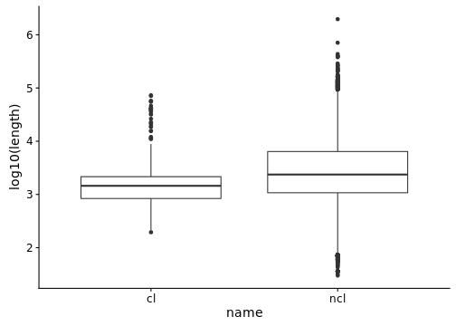
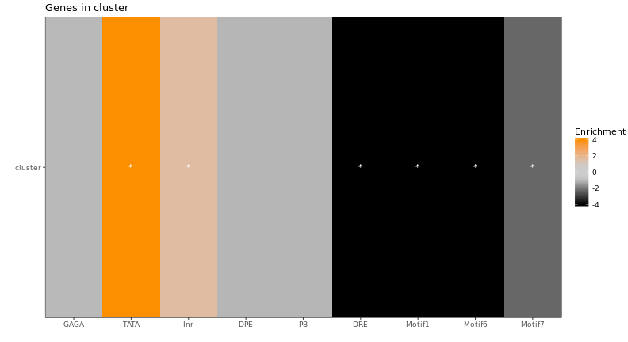

Look at the gene clusters and their length.

we will exclude histone and Ste, because many histones come from the same location but have different names. Select genes with more than four with similar names and nearby are considered clusters.


**Project:** Promoter Opening

**Author:** [Vivek](mailto:vir@stowers.org)

**Generated:** Tue Sep 01 2020, 02:10 AM


```
## 
## 	Wilcoxon rank sum test with continuity correction
## 
## data:  fb.txs[fb.txs$fb_symbol %in% cluster_genes] %>% width() and fb.txs %>% width()
## W = 5055400, p-value < 2.2e-16
## alternative hypothesis: true location shift is not equal to 0
```




```
## `summarise()` ungrouping output (override with `.groups` argument)
```



## Session information

For reproducibility, this analysis was performed with the following R/Bioconductor session:


```
R version 3.4.4 (2018-03-15)
Platform: x86_64-pc-linux-gnu (64-bit)
Running under: Ubuntu 16.04.4 LTS

Matrix products: default
BLAS: /usr/lib/libblas/libblas.so.3.6.0
LAPACK: /usr/lib/lapack/liblapack.so.3.6.0

locale:
 [1] LC_CTYPE=en_US.UTF-8       LC_NUMERIC=C              
 [3] LC_TIME=en_US.UTF-8        LC_COLLATE=en_US.UTF-8    
 [5] LC_MONETARY=en_US.UTF-8    LC_MESSAGES=en_US.UTF-8   
 [7] LC_PAPER=en_US.UTF-8       LC_NAME=C                 
 [9] LC_ADDRESS=C               LC_TELEPHONE=C            
[11] LC_MEASUREMENT=en_US.UTF-8 LC_IDENTIFICATION=C       

attached base packages:
[1] parallel  stats4    stats     graphics  grDevices utils     datasets 
[8] methods   base     

other attached packages:
 [1] scales_1.1.1                          BSgenome.Dmelanogaster.UCSC.dm6_1.4.1
 [3] BSgenome_1.46.0                       rtracklayer_1.38.3                   
 [5] Biostrings_2.46.0                     XVector_0.18.0                       
 [7] matrixStats_0.53.1                    GenomicRanges_1.30.3                 
 [9] GenomeInfoDb_1.14.0                   IRanges_2.12.0                       
[11] S4Vectors_0.16.0                      BiocGenerics_0.24.0                  
[13] pander_0.6.1                          cowplot_0.9.2                        
[15] Hmisc_4.1-1                           Formula_1.2-3                        
[17] survival_2.42-3                       lattice_0.20-35                      
[19] dplyr_1.0.2                           ggplot2_2.2.1                        
[21] Matrix_1.2-14                         magrittr_1.5                         

loaded via a namespace (and not attached):
 [1] Biobase_2.38.0             splines_3.4.4             
 [3] highr_0.6                  latticeExtra_0.6-28       
 [5] GenomeInfoDbData_1.0.0     Rsamtools_1.30.0          
 [7] pillar_1.4.6               backports_1.1.2           
 [9] glue_1.4.2                 digest_0.6.25             
[11] RColorBrewer_1.1-2         checkmate_1.8.5           
[13] colorspace_1.4-1           htmltools_0.3.6           
[15] plyr_1.8.4                 XML_3.98-1.11             
[17] pkgconfig_2.0.3            zlibbioc_1.24.0           
[19] purrr_0.3.4                BiocParallel_1.12.0       
[21] htmlTable_1.11.2           tibble_3.0.3              
[23] generics_0.0.2             farver_2.0.3              
[25] ellipsis_0.3.1             SummarizedExperiment_1.8.1
[27] nnet_7.3-12                lazyeval_0.2.1            
[29] crayon_1.3.4               evaluate_0.14             
[31] foreign_0.8-70             tools_3.4.4               
[33] data.table_1.11.2          lifecycle_0.2.0           
[35] stringr_1.3.1              munsell_0.5.0             
[37] cluster_2.0.7-1            DelayedArray_0.4.1        
[39] compiler_3.4.4             rlang_0.4.7               
[41] grid_3.4.4                 RCurl_1.95-4.10           
[43] rstudioapi_0.7             htmlwidgets_1.2           
[45] bitops_1.0-6               base64enc_0.1-3           
[47] labeling_0.3               gtable_0.3.0              
[49] R6_2.4.1                   GenomicAlignments_1.14.2  
[51] gridExtra_2.3              knitr_1.20                
[53] stringi_1.2.2              Rcpp_0.12.16              
[55] vctrs_0.3.3                rpart_4.1-13              
[57] acepack_1.4.1              tidyselect_1.1.0          
```
