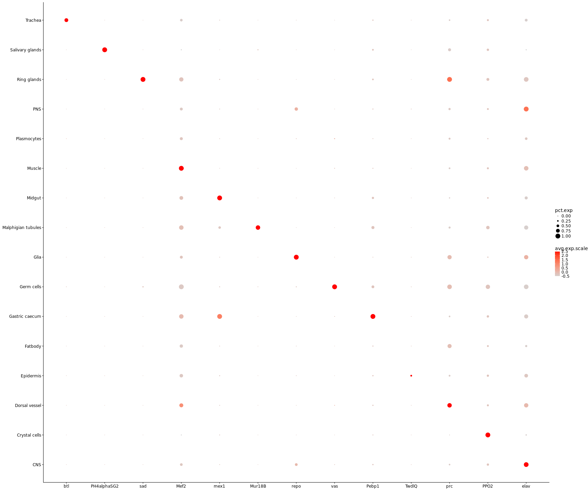
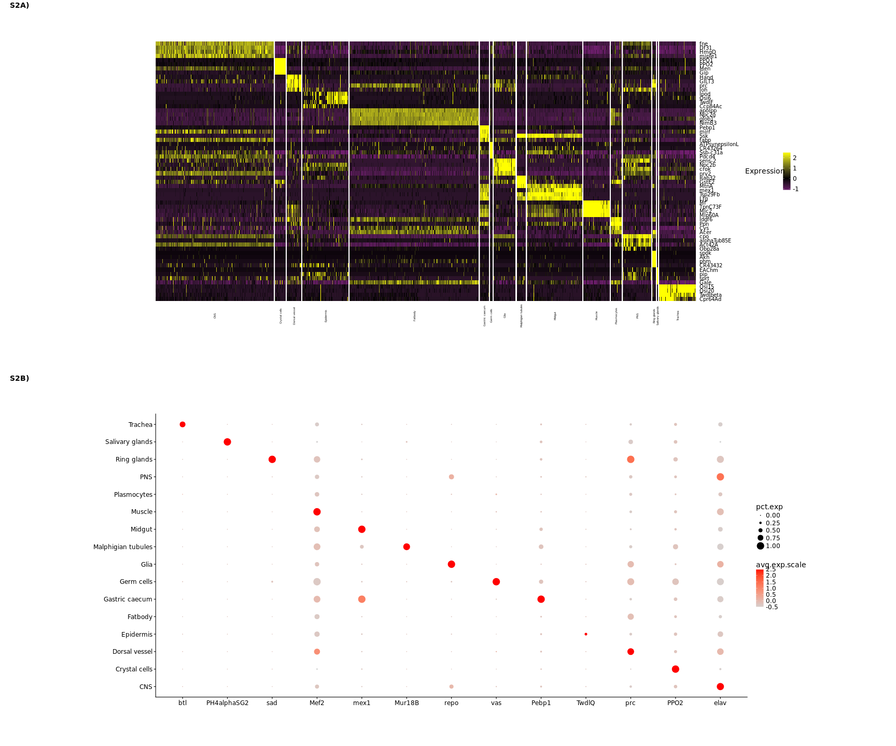

```
## Loading required package: ggplot2
```

```
## Loading required package: cowplot
```

```
## 
## Attaching package: 'cowplot'
```

```
## The following object is masked from 'package:ggplot2':
## 
##     ggsave
```

```
## Loading required package: Matrix
```

```
## 
## Attaching package: 'tidyr'
```

```
## The following object is masked from 'package:Matrix':
## 
##     expand
```

```
## 
## Attaching package: 'dplyr'
```

```
## The following objects are masked from 'package:stats':
## 
##     filter, lag
```

```
## The following objects are masked from 'package:base':
## 
##     intersect, setdiff, setequal, union
```

```
## 
## Attaching package: 'magrittr'
```

```
## The following object is masked from 'package:tidyr':
## 
##     extract
```

Find marker genes for the cluters and plot some known markers

**Project:** Promoter Opening

**Author:** [Vivek](mailto:vir@stowers.org)

**Generated:** Mon Sep 24 2018, 08:32 PM





```
## Calculating cluster CNS
```

```
## Calculating cluster Crystal cells
```

```
## Calculating cluster Dorsal vessel
```

```
## Calculating cluster Epidermis
```

```
## Calculating cluster Fatbody
```

```
## Calculating cluster Gastric caecum
```

```
## Calculating cluster Germ cells
```

```
## Calculating cluster Glia
```

```
## Calculating cluster Malphigian tubules
```

```
## Calculating cluster Midgut
```

```
## Calculating cluster Muscle
```

```
## Calculating cluster Plasmocytes
```

```
## Calculating cluster PNS
```

```
## Calculating cluster Ring glands
```

```
## Calculating cluster Salivary glands
```

```
## Calculating cluster Trachea
```





## Session information

For reproducibility, this analysis was performed with the following R/Bioconductor session:


```
R version 3.4.4 (2018-03-15)
Platform: x86_64-pc-linux-gnu (64-bit)
Running under: Ubuntu 16.04.4 LTS

Matrix products: default
BLAS: /usr/lib/libblas/libblas.so.3.6.0
LAPACK: /usr/lib/lapack/liblapack.so.3.6.0

locale:
 [1] LC_CTYPE=en_US.UTF-8       LC_NUMERIC=C              
 [3] LC_TIME=en_US.UTF-8        LC_COLLATE=en_US.UTF-8    
 [5] LC_MONETARY=en_US.UTF-8    LC_MESSAGES=en_US.UTF-8   
 [7] LC_PAPER=en_US.UTF-8       LC_NAME=C                 
 [9] LC_ADDRESS=C               LC_TELEPHONE=C            
[11] LC_MEASUREMENT=en_US.UTF-8 LC_IDENTIFICATION=C       

attached base packages:
[1] stats     graphics  grDevices utils     datasets  base     

other attached packages:
 [1] bindrcpp_0.2.2     Cairo_1.5-9        mccr_0.4.4         RColorBrewer_1.1-2
 [5] magrittr_1.5       dplyr_0.7.4        tidyr_0.8.0        Seurat_2.3.1      
 [9] Matrix_1.2-14      cowplot_0.9.2      ggplot2_2.2.1      pander_0.6.1      
[13] knitr_1.20        

loaded via a namespace (and not attached):
  [1] snow_0.4-2           backports_1.1.2      Hmisc_4.1-1         
  [4] VGAM_1.0-5           sn_1.5-2             plyr_1.8.4          
  [7] igraph_1.2.1         lazyeval_0.2.1       splines_3.4.4       
 [10] digest_0.6.15        foreach_1.4.4        htmltools_0.3.6     
 [13] lars_1.2             gdata_2.18.0         checkmate_1.8.5     
 [16] cluster_2.0.7-1      mixtools_1.1.0       ROCR_1.0-7          
 [19] sfsmisc_1.1-2        recipes_0.1.2        gower_0.1.2         
 [22] dimRed_0.1.0         R.utils_2.6.0        methods_3.4.4       
 [25] colorspace_1.3-2     jsonlite_1.5         bindr_0.1.1         
 [28] survival_2.42-3      zoo_1.8-1            iterators_1.0.9     
 [31] ape_5.1              glue_1.2.0           DRR_0.0.3           
 [34] gtable_0.2.0         ipred_0.9-6          kernlab_0.9-26      
 [37] ddalpha_1.3.3        prabclus_2.2-6       DEoptimR_1.0-8      
 [40] abind_1.4-5          scales_0.5.0         mvtnorm_1.0-7       
 [43] Rcpp_0.12.16         metap_0.9            dtw_1.18-1          
 [46] htmlTable_1.11.2     magic_1.5-8          tclust_1.3-1        
 [49] reticulate_1.7       foreign_0.8-70       proxy_0.4-22        
 [52] mclust_5.4           SDMTools_1.1-221     Formula_1.2-3       
 [55] stats4_3.4.4         tsne_0.1-3           lava_1.6.1          
 [58] prodlim_2018.04.18   htmlwidgets_1.2      FNN_1.1             
 [61] gplots_3.0.1         fpc_2.1-11           acepack_1.4.1       
 [64] modeltools_0.2-21    ica_1.0-1            pkgconfig_2.0.1     
 [67] R.methodsS3_1.7.1    flexmix_2.3-14       nnet_7.3-12         
 [70] caret_6.0-79         labeling_0.3         tidyselect_0.2.4    
 [73] rlang_0.2.0          reshape2_1.4.3       munsell_0.4.3       
 [76] tools_3.4.4          ranger_0.9.0         broom_0.4.4         
 [79] ggridges_0.5.0       evaluate_0.10.1      geometry_0.3-6      
 [82] stringr_1.3.1        ModelMetrics_1.1.0   fitdistrplus_1.0-9  
 [85] robustbase_0.93-0    caTools_1.17.1       purrr_0.2.4         
 [88] RANN_2.5.1           pbapply_1.3-4        nlme_3.1-137        
 [91] R.oo_1.22.0          RcppRoll_0.2.2       compiler_3.4.4      
 [94] rstudioapi_0.7       png_0.1-7            tibble_1.4.2        
 [97] stringi_1.2.2        highr_0.6            lattice_0.20-35     
[100] trimcluster_0.1-2    psych_1.8.4          diffusionMap_1.1-0  
[103] pillar_1.2.2         lmtest_0.9-36        data.table_1.11.2   
[106] bitops_1.0-6         irlba_2.3.2          R6_2.2.2            
[109] latticeExtra_0.6-28  KernSmooth_2.23-15   gridExtra_2.3       
[112] codetools_0.2-15     MASS_7.3-50          gtools_3.5.0        
[115] assertthat_0.2.0     CVST_0.2-1           withr_2.1.2         
[118] mnormt_1.5-5         diptest_0.75-7       parallel_3.4.4      
[121] doSNOW_1.0.16        grid_3.4.4           rpart_4.1-13        
[124] timeDate_3043.102    class_7.3-14         segmented_0.5-3.0   
[127] Rtsne_0.13           numDeriv_2016.8-1    scatterplot3d_0.3-41
[130] lubridate_1.7.4      base64enc_0.1-3     
```
