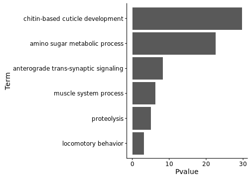
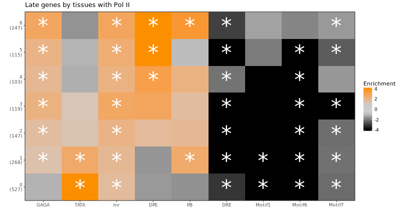
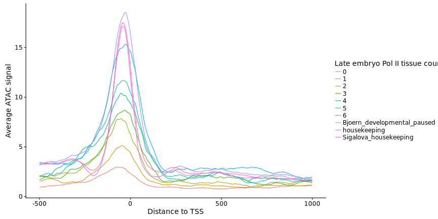
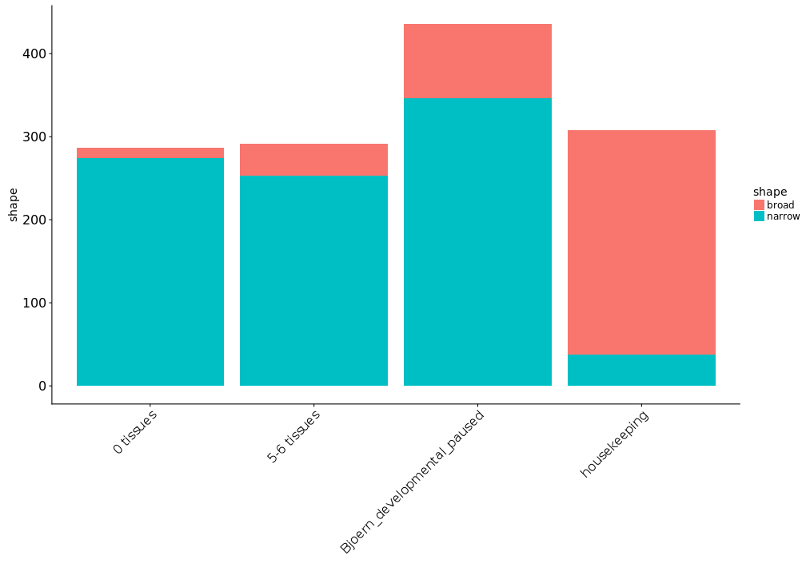

**Project:** Promoter Opening

**Author:** [Vivek](mailto:vir@stowers.org)

**Generated:** Sun Sep 27 2020, 09:03 PM

## Overview

  - Define late induced genes
  - GO analysis of late genes
  - Seperate late genes to groups by pol II occupancy in different tissues
  - RNA-seq expression
  - Promoter element enrichments
  - ImaGO terms
  - Gene length
  - ATAC 14-17h
  - MNase 2-4h and 14-17hrs

## Late induced genes and housekeeping genes

Whole-embryo wild-type 2-4h (Nina) and 14-17h (Malini) were processed with `kallisto` and compared with `DESeq2`. 

Late-induced genes are those considered up-regulated late versus early with a TPM of less than 25 early and greater than 100 late.

As a comparison group, we will also define housekeeping genes as those that show no differential expression between the early and late time points and are expressed with an TPM of at least 100 in both stages.


-----------------------------------------
     gene_group       count   median_TPM 
-------------------- ------- ------------
 Housekeeping genes    662       30.3    

 Late-induced genes   1530      27.75    
-----------------------------------------

Table: Summary of late-induced genes


```
##                                          wt_14to14.5h_1 
## "../fastq/rnaseq/kallisto//wt_14to14.5h_1/abundance.h5" 
##                                          wt_14to14.5h_2 
## "../fastq/rnaseq/kallisto//wt_14to14.5h_2/abundance.h5" 
##                                          wt_17to17.5h_1 
## "../fastq/rnaseq/kallisto//wt_17to17.5h_1/abundance.h5" 
##                                          wt_17to17.5h_2 
## "../fastq/rnaseq/kallisto//wt_17to17.5h_2/abundance.h5"
```

```
## 1 2 3 4
```
## GO analysis

Below are the top 5 GO categories for each gene group (excluding categories that contain 5 or less genes). The full results are in the output folder for this document as `go_results.xls`.



## Dividing genes by Pol II presence in different tissues

Next, we will calculate Pol II enrichment levels at the promoters of all genes and divide the late-induced genes into groups based on the number of tissues where Pol II is detected at least 2-fold above background. We will use the following Pol II samples:


```
## `summarise()` regrouping output by 'label' (override with `.groups` argument)
```


------------------------------------------------------------
    label       factor   median_enrichment   max_enrichment 
-------------- -------- ------------------- ----------------
 early_embryo   polii         0.04969            6.941      

   embryo14     polii         0.4641             6.819      

  epidermis     polii         0.3205             6.134      

     glia       polii          0.334             5.632      

     gut        polii         0.4288              6.03      

    muscle      polii         0.6466             6.124      

    neuron      polii         0.4475             6.204      

   trachea      polii         0.2465             5.236      
------------------------------------------------------------

Table: Summary of Pol II enrichments (log2)


```
## `summarise()` regrouping output by 'factor', 'label' (override with `.groups` argument)
```

```
## `summarise()` ungrouping output (override with `.groups` argument)
```

Using a threshold of 2-fold enrichment over input, we can divide the late-induced genes by the number of tissues where Pol II is detected:


```
## `summarise()` ungrouping output (override with `.groups` argument)
```


-----------------
 Tissues   count 
--------- -------
    0       527  

    1       268  

    2       147  

    3       119  

    4       103  

    5       115  

    6       247  
-----------------

Table: Late-induced genes

We will also define fewer groups by combining some of the above groups:


```
## `summarise()` ungrouping output (override with `.groups` argument)
```


---------------------
   Tissues     count 
------------- -------
  0 tissues     527  

 1-2 tissues    415  

 3-4 tissues    222  

 5-6 tissues    362  
---------------------

Table: Alternate groups for late-induced genes
## Sigalova and Bjoern groups


## RNA-seq expression


```
## Warning: Removed 17 rows containing non-finite values (stat_boxplot).
```


```
## Warning: Removed 30 rows containing non-finite values (stat_boxplot).
```


```
## Warning: Removed 30 rows containing non-finite values (stat_boxplot).
```


```
## 
## 	Wilcoxon rank sum test with continuity correction
## 
## data:  exp.df %>% filter(group_name == test_group_1) %>% dplyr::select(variable) %>%  and exp.df %>% filter(group_name == test_group_2) %>% dplyr::select(variable) %>%     as.matrix and     as.matrix
## W = 112270, p-value = 7.196e-06
## alternative hypothesis: true location shift is not equal to 0
```

```
## 
## 	Wilcoxon rank sum test with continuity correction
## 
## data:  exp.df %>% filter(group_name == test_group_1) %>% dplyr::select(variable) %>%  and exp.df %>% filter(group_name == test_group_2) %>% dplyr::select(variable) %>%     as.matrix and     as.matrix
## W = 69678, p-value = 8.214e-12
## alternative hypothesis: true location shift is not equal to 0
```

```
## 
## 	Wilcoxon rank sum test with continuity correction
## 
## data:  exp.df %>% filter(group_name == test_group_1) %>% dplyr::select(variable) %>%  and exp.df %>% filter(group_name == test_group_2) %>% dplyr::select(variable) %>%     as.matrix and     as.matrix
## W = 119420, p-value = 1.656e-10
## alternative hypothesis: true location shift is not equal to 0
```

```
## Warning: Removed 113 rows containing non-finite values (stat_boxplot).
```


```
## Warning: Removed 113 rows containing non-finite values (stat_boxplot).
```


## Promoter element enrichments

```
## `summarise()` ungrouping output (override with `.groups` argument)
## `summarise()` ungrouping output (override with `.groups` argument)
## `summarise()` ungrouping output (override with `.groups` argument)
```


## Promoter element enrichments


```
## `summarise()` ungrouping output (override with `.groups` argument)
## `summarise()` ungrouping output (override with `.groups` argument)
## `summarise()` ungrouping output (override with `.groups` argument)
## `summarise()` ungrouping output (override with `.groups` argument)
## `summarise()` ungrouping output (override with `.groups` argument)
## `summarise()` ungrouping output (override with `.groups` argument)
## `summarise()` ungrouping output (override with `.groups` argument)
## `summarise()` ungrouping output (override with `.groups` argument)
```



```
## `summarise()` ungrouping output (override with `.groups` argument)
## `summarise()` ungrouping output (override with `.groups` argument)
## `summarise()` ungrouping output (override with `.groups` argument)
## `summarise()` ungrouping output (override with `.groups` argument)
## `summarise()` ungrouping output (override with `.groups` argument)
```


```
## `summarise()` ungrouping output (override with `.groups` argument)
## `summarise()` ungrouping output (override with `.groups` argument)
## `summarise()` ungrouping output (override with `.groups` argument)
## `summarise()` ungrouping output (override with `.groups` argument)
## `summarise()` ungrouping output (override with `.groups` argument)
```


```
## `summarise()` ungrouping output (override with `.groups` argument)
## `summarise()` ungrouping output (override with `.groups` argument)
## `summarise()` ungrouping output (override with `.groups` argument)
## `summarise()` ungrouping output (override with `.groups` argument)
## `summarise()` ungrouping output (override with `.groups` argument)
## `summarise()` ungrouping output (override with `.groups` argument)
## `summarise()` ungrouping output (override with `.groups` argument)
## `summarise()` ungrouping output (override with `.groups` argument)
```


```
## `summarise()` ungrouping output (override with `.groups` argument)
## `summarise()` ungrouping output (override with `.groups` argument)
## `summarise()` ungrouping output (override with `.groups` argument)
## `summarise()` ungrouping output (override with `.groups` argument)
## `summarise()` ungrouping output (override with `.groups` argument)
## `summarise()` ungrouping output (override with `.groups` argument)
## `summarise()` ungrouping output (override with `.groups` argument)
## `summarise()` ungrouping output (override with `.groups` argument)
## `summarise()` ungrouping output (override with `.groups` argument)
## `summarise()` ungrouping output (override with `.groups` argument)
## `summarise()` ungrouping output (override with `.groups` argument)
```


```
## `summarise()` ungrouping output (override with `.groups` argument)
## `summarise()` ungrouping output (override with `.groups` argument)
## `summarise()` ungrouping output (override with `.groups` argument)
## `summarise()` ungrouping output (override with `.groups` argument)
## `summarise()` ungrouping output (override with `.groups` argument)
## `summarise()` ungrouping output (override with `.groups` argument)
## `summarise()` ungrouping output (override with `.groups` argument)
## `summarise()` ungrouping output (override with `.groups` argument)
## `summarise()` ungrouping output (override with `.groups` argument)
## `summarise()` ungrouping output (override with `.groups` argument)
## `summarise()` ungrouping output (override with `.groups` argument)
## `summarise()` ungrouping output (override with `.groups` argument)
## `summarise()` ungrouping output (override with `.groups` argument)
## `summarise()` ungrouping output (override with `.groups` argument)
## `summarise()` ungrouping output (override with `.groups` argument)
## `summarise()` ungrouping output (override with `.groups` argument)
## `summarise()` ungrouping output (override with `.groups` argument)
## `summarise()` ungrouping output (override with `.groups` argument)
## `summarise()` ungrouping output (override with `.groups` argument)
## `summarise()` ungrouping output (override with `.groups` argument)
## `summarise()` ungrouping output (override with `.groups` argument)
```


## ImaGO terms


```
## `summarise()` ungrouping output (override with `.groups` argument)
## `summarise()` ungrouping output (override with `.groups` argument)
## `summarise()` ungrouping output (override with `.groups` argument)
## `summarise()` ungrouping output (override with `.groups` argument)
## `summarise()` ungrouping output (override with `.groups` argument)
## `summarise()` ungrouping output (override with `.groups` argument)
## `summarise()` ungrouping output (override with `.groups` argument)
## `summarise()` ungrouping output (override with `.groups` argument)
```


```
## `summarise()` ungrouping output (override with `.groups` argument)
## `summarise()` ungrouping output (override with `.groups` argument)
## `summarise()` ungrouping output (override with `.groups` argument)
## `summarise()` ungrouping output (override with `.groups` argument)
## `summarise()` ungrouping output (override with `.groups` argument)
```


```
## `summarise()` ungrouping output (override with `.groups` argument)
## `summarise()` ungrouping output (override with `.groups` argument)
## `summarise()` ungrouping output (override with `.groups` argument)
## `summarise()` ungrouping output (override with `.groups` argument)
## `summarise()` ungrouping output (override with `.groups` argument)
## `summarise()` ungrouping output (override with `.groups` argument)
## `summarise()` ungrouping output (override with `.groups` argument)
## `summarise()` ungrouping output (override with `.groups` argument)
```

```
## 
## 	Wilcoxon rank sum test with continuity correction
## 
## data:  counts.df %>% filter(group_name == test_group_1) %>% dplyr::select(variable) %>%  and counts.df %>% filter(group_name == test_group_2) %>% dplyr::select(variable) %>%     as.matrix and     as.matrix
## W = 3460.5, p-value < 2.2e-16
## alternative hypothesis: true location shift is not equal to 0
```

```
## `summarise()` ungrouping output (override with `.groups` argument)
## `summarise()` ungrouping output (override with `.groups` argument)
## `summarise()` ungrouping output (override with `.groups` argument)
## `summarise()` ungrouping output (override with `.groups` argument)
## `summarise()` ungrouping output (override with `.groups` argument)
```

```
## 
## 	Wilcoxon rank sum test with continuity correction
## 
## data:  counts.df %>% filter(group_name == test_group_1) %>% dplyr::select(variable) %>%  and counts.df %>% filter(group_name == test_group_2) %>% dplyr::select(variable) %>%     as.matrix and     as.matrix
## W = 5337, p-value < 2.2e-16
## alternative hypothesis: true location shift is not equal to 0
```


## Gene length


```
## `summarise()` ungrouping output (override with `.groups` argument)
## `summarise()` ungrouping output (override with `.groups` argument)
## `summarise()` ungrouping output (override with `.groups` argument)
## `summarise()` ungrouping output (override with `.groups` argument)
## `summarise()` ungrouping output (override with `.groups` argument)
## `summarise()` ungrouping output (override with `.groups` argument)
## `summarise()` ungrouping output (override with `.groups` argument)
```


```
## `summarise()` ungrouping output (override with `.groups` argument)
## `summarise()` ungrouping output (override with `.groups` argument)
## `summarise()` ungrouping output (override with `.groups` argument)
## `summarise()` ungrouping output (override with `.groups` argument)
```


```
## `summarise()` ungrouping output (override with `.groups` argument)
## `summarise()` ungrouping output (override with `.groups` argument)
## `summarise()` ungrouping output (override with `.groups` argument)
## `summarise()` ungrouping output (override with `.groups` argument)
```


```
## `summarise()` ungrouping output (override with `.groups` argument)
## `summarise()` ungrouping output (override with `.groups` argument)
## `summarise()` ungrouping output (override with `.groups` argument)
## `summarise()` ungrouping output (override with `.groups` argument)
## `summarise()` ungrouping output (override with `.groups` argument)
## `summarise()` ungrouping output (override with `.groups` argument)
## `summarise()` ungrouping output (override with `.groups` argument)
```


```
## `summarise()` ungrouping output (override with `.groups` argument)
## `summarise()` ungrouping output (override with `.groups` argument)
## `summarise()` ungrouping output (override with `.groups` argument)
## `summarise()` ungrouping output (override with `.groups` argument)
## `summarise()` ungrouping output (override with `.groups` argument)
## `summarise()` ungrouping output (override with `.groups` argument)
## `summarise()` ungrouping output (override with `.groups` argument)
## `summarise()` ungrouping output (override with `.groups` argument)
## `summarise()` ungrouping output (override with `.groups` argument)
## `summarise()` ungrouping output (override with `.groups` argument)
```


```
## `summarise()` ungrouping output (override with `.groups` argument)
## `summarise()` ungrouping output (override with `.groups` argument)
## `summarise()` ungrouping output (override with `.groups` argument)
## `summarise()` ungrouping output (override with `.groups` argument)
## `summarise()` ungrouping output (override with `.groups` argument)
## `summarise()` ungrouping output (override with `.groups` argument)
## `summarise()` ungrouping output (override with `.groups` argument)
```

```
## 
## 	Wilcoxon rank sum test with continuity correction
## 
## data:  filter(., group_name == test_group_1) %>% dplyr::select(variable) %>%  and filter(., group_name == test_group_2) %>% dplyr::select(variable) %>%     as.matrix and     as.matrix
## W = 10258, p-value < 2.2e-16
## alternative hypothesis: true location shift is not equal to 0
```

```
## `summarise()` ungrouping output (override with `.groups` argument)
## `summarise()` ungrouping output (override with `.groups` argument)
## `summarise()` ungrouping output (override with `.groups` argument)
## `summarise()` ungrouping output (override with `.groups` argument)
```

```
## 
## 	Wilcoxon rank sum test with continuity correction
## 
## data:  filter(., group_name == test_group_1) %>% dplyr::select(variable) %>%  and filter(., group_name == test_group_2) %>% dplyr::select(variable) %>%     as.matrix and     as.matrix
## W = 15528, p-value < 2.2e-16
## alternative hypothesis: true location shift is not equal to 0
```
## Go analysis tata and highly paused genes


## ATAC 14-17h



```
## Warning: Removed 299 rows containing non-finite values (stat_boxplot).
```


```
## Warning: Removed 630 rows containing non-finite values (stat_boxplot).
```


```
## 
## 	Wilcoxon rank sum test with continuity correction
## 
## data:  filter(., group_name == test_group_1) %>% dplyr::select(variable) %>%  and filter(., group_name == test_group_2) %>% dplyr::select(variable) %>%     as.matrix and     as.matrix
## W = 21568, p-value < 2.2e-16
## alternative hypothesis: true location shift is not equal to 0
```

```
## 
## 	Wilcoxon rank sum test with continuity correction
## 
## data:  filter(., group_name == test_group_1) %>% dplyr::select(variable) %>%  and filter(., group_name == test_group_2) %>% dplyr::select(variable) %>%     as.matrix and     as.matrix
## W = 21224, p-value < 2.2e-16
## alternative hypothesis: true location shift is not equal to 0
```

```
## 
## 	Wilcoxon rank sum test with continuity correction
## 
## data:  filter(., group_name == test_group_1) %>% dplyr::select(variable) %>%  and filter(., group_name == test_group_2) %>% dplyr::select(variable) %>%     as.matrix and     as.matrix
## W = 66473, p-value < 2.2e-16
## alternative hypothesis: true location shift is not equal to 0
```

```
## Warning: Removed 630 rows containing non-finite values (stat_boxplot).
```


## MNase 2-4h and 14-17hrs


## Tissue specific ATAC signals

```
## `summarise()` ungrouping output (override with `.groups` argument)
## `summarise()` ungrouping output (override with `.groups` argument)
## `summarise()` ungrouping output (override with `.groups` argument)
## `summarise()` ungrouping output (override with `.groups` argument)
## `summarise()` ungrouping output (override with `.groups` argument)
## `summarise()` ungrouping output (override with `.groups` argument)
## `summarise()` ungrouping output (override with `.groups` argument)
## `summarise()` ungrouping output (override with `.groups` argument)
## `summarise()` ungrouping output (override with `.groups` argument)
## `summarise()` ungrouping output (override with `.groups` argument)
## `summarise()` ungrouping output (override with `.groups` argument)
```

```
## Warning in read.table(file = file, header = header, sep = sep, quote
## = quote, : incomplete final line found by readTableHeader on 'data/
## figure5c_tissue_atac_samples.csv'
```


-------------------------------------------------------------------------------------------------------------
   label     window_upstream   window_downstream                              ip                             
----------- ----------------- ------------------- -----------------------------------------------------------
 epidermis         150                 0           Epidermis_7021_INTACT_14_17h_ATAC_1.bam_from0to100_rpm.bw 

    gut            150                 0                Gut_INTACT_14_17h_ATAC_1.bam_from0to100_rpm.bw       

  muscle           150                 0            Muscle_mef2_INTACT_14_17h_ATAC_1.bam_from0to100_rpm.bw   

  neuron           150                 0            Neuron_elav_INTACT_14_17h_ATAC_1.bam_from0to100_rpm.bw   
-------------------------------------------------------------------------------------------------------------

Table: ATAC samples


```
## `summarise()` ungrouping output (override with `.groups` argument)
```


```
## `summarise()` ungrouping output (override with `.groups` argument)
```


```
## `summarise()` ungrouping output (override with `.groups` argument)
```


```
## 
## 	Wilcoxon rank sum test with continuity correction
## 
## data:  tata_genes_atac and dual_tata_genes_atac
## W = 48562, p-value < 2.2e-16
## alternative hypothesis: true location shift is not equal to 0
```

```
## 
## 	Wilcoxon rank sum test with continuity correction
## 
## data:  tata_genes_atac and paused_genes_atac
## W = 12429, p-value < 2.2e-16
## alternative hypothesis: true location shift is not equal to 0
```

```
## 
## 	Wilcoxon rank sum test with continuity correction
## 
## data:  tata_genes_atac and highly_paused_genes_atac
## W = 8400, p-value < 2.2e-16
## alternative hypothesis: true location shift is not equal to 0
```
## Conservation Plots


```
## 
## 	Wilcoxon rank sum test with continuity correction
## 
## data:  filter(., group_name == test_group_1) %>% dplyr::select(variable) %>%  and filter(., group_name == test_group_2) %>% dplyr::select(variable) %>%     as.matrix and     as.matrix
## W = 23340, p-value < 2.2e-16
## alternative hypothesis: true location shift is not equal to 0
```


## Variation Plots based on Sigalova paper variation across different Drosphila species


```
## 
## 	Wilcoxon rank sum test with continuity correction
## 
## data:  filter(., group_name == test_group_1) %>% dplyr::select(variable) %>%  and filter(., group_name == test_group_2) %>% dplyr::select(variable) %>%     as.matrix and     as.matrix
## W = 58844, p-value < 2.2e-16
## alternative hypothesis: true location shift is not equal to 0
```


## Shape plot: Narrow vs Broad


```
## Warning: attributes are not identical across measure variables; they will be
## dropped

## Warning: attributes are not identical across measure variables; they will be
## dropped
```

```
## [[1]]
```


```
## 
## [[2]]
```


```
## 
## [[3]]
```


```
## 
## [[4]]
```


```
## [[1]]
```


```
## 
## [[2]]
```


```
## 
## [[3]]
```


```
## 
## [[4]]
```


## Session information

For reproducibility, this analysis was performed with the following R/Bioconductor session:


```
R version 3.4.4 (2018-03-15)
Platform: x86_64-pc-linux-gnu (64-bit)
Running under: Ubuntu 16.04.4 LTS

Matrix products: default
BLAS: /usr/lib/libblas/libblas.so.3.6.0
LAPACK: /usr/lib/lapack/liblapack.so.3.6.0

locale:
 [1] LC_CTYPE=en_US.UTF-8       LC_NUMERIC=C              
 [3] LC_TIME=en_US.UTF-8        LC_COLLATE=en_US.UTF-8    
 [5] LC_MONETARY=en_US.UTF-8    LC_MESSAGES=en_US.UTF-8   
 [7] LC_PAPER=en_US.UTF-8       LC_NAME=C                 
 [9] LC_ADDRESS=C               LC_TELEPHONE=C            
[11] LC_MEASUREMENT=en_US.UTF-8 LC_IDENTIFICATION=C       

attached base packages:
 [1] grid      parallel  stats4    stats     graphics  grDevices utils    
 [8] datasets  methods   base     

other attached packages:
 [1] gridExtra_2.3                            
 [2] ggseqlogo_0.1                            
 [3] org.Dm.eg.db_3.5.0                       
 [4] GOstats_2.44.0                           
 [5] graph_1.56.0                             
 [6] Category_2.44.0                          
 [7] Matrix_1.2-14                            
 [8] BSgenome.Dmelanogaster.UCSC.dm6_1.4.1    
 [9] BSgenome_1.46.0                          
[10] Biostrings_2.46.0                        
[11] XVector_0.18.0                           
[12] scales_1.1.1                             
[13] lattice_0.20-35                          
[14] reshape2_1.4.3                           
[15] rtracklayer_1.38.3                       
[16] pander_0.6.1                             
[17] magrittr_1.5                             
[18] DESeq2_1.18.1                            
[19] SummarizedExperiment_1.8.1               
[20] DelayedArray_0.4.1                       
[21] matrixStats_0.53.1                       
[22] tximport_1.6.0                           
[23] TxDb.Dmelanogaster.UCSC.dm6.ensGene_3.4.1
[24] GenomicFeatures_1.30.3                   
[25] AnnotationDbi_1.40.0                     
[26] Biobase_2.38.0                           
[27] Gviz_1.22.3                              
[28] GenomicRanges_1.30.3                     
[29] GenomeInfoDb_1.14.0                      
[30] IRanges_2.12.0                           
[31] S4Vectors_0.16.0                         
[32] BiocGenerics_0.24.0                      
[33] tidyr_0.8.0                              
[34] dplyr_1.0.2                              
[35] cowplot_0.9.2                            
[36] ggplot2_2.2.1                            

loaded via a namespace (and not attached):
 [1] colorspace_1.4-1              ellipsis_0.3.1               
 [3] biovizBase_1.26.0             htmlTable_1.11.2             
 [5] base64enc_0.1-3               dichromat_2.0-0              
 [7] rstudioapi_0.7                farver_2.0.3                 
 [9] bit64_0.9-7                   fansi_0.4.1                  
[11] interactiveDisplayBase_1.16.0 splines_3.4.4                
[13] geneplotter_1.56.0            knitr_1.20                   
[15] Formula_1.2-3                 Rsamtools_1.30.0             
[17] annotate_1.56.2               GO.db_3.5.0                  
[19] cluster_2.0.7-1               shiny_1.1.0                  
[21] compiler_3.4.4                httr_1.3.1                   
[23] backports_1.1.2               assertthat_0.2.1             
[25] lazyeval_0.2.1                cli_2.0.2                    
[27] later_0.7.2                   acepack_1.4.1                
[29] htmltools_0.3.6               prettyunits_1.1.1            
[31] tools_3.4.4                   gtable_0.3.0                 
[33] glue_1.4.2                    GenomeInfoDbData_1.0.0       
[35] Rcpp_0.12.16                  vctrs_0.3.3                  
[37] stringr_1.3.1                 mime_0.5                     
[39] lifecycle_0.2.0               ensembldb_2.2.2              
[41] XML_3.98-1.11                 AnnotationHub_2.10.1         
[43] zlibbioc_1.24.0               VariantAnnotation_1.24.5     
[45] BiocInstaller_1.28.0          promises_1.0.1               
[47] ProtGenerics_1.10.0           RBGL_1.54.0                  
[49] rhdf5_2.22.0                  AnnotationFilter_1.2.0       
[51] RColorBrewer_1.1-2            yaml_2.1.19                  
[53] curl_3.2                      memoise_1.1.0                
[55] biomaRt_2.34.2                rpart_4.1-13                 
[57] latticeExtra_0.6-28           stringi_1.2.2                
[59] RSQLite_2.1.0                 highr_0.6                    
[61] genefilter_1.60.0             RMySQL_0.10.15               
[63] checkmate_1.8.5               BiocParallel_1.12.0          
[65] rlang_0.4.7                   pkgconfig_2.0.3              
[67] bitops_1.0-6                  evaluate_0.14                
[69] purrr_0.3.4                   labeling_0.3                 
[71] GenomicAlignments_1.14.2      htmlwidgets_1.2              
[73] bit_1.1-13                    tidyselect_1.1.0             
[75] AnnotationForge_1.20.0        GSEABase_1.40.1              
[77] plyr_1.8.4                    R6_2.4.1                     
[79] generics_0.0.2                Hmisc_4.1-1                  
[81] DBI_1.0.0                     pillar_1.4.6                 
[83] foreign_0.8-70                survival_2.42-3              
[85] RCurl_1.95-4.10               nnet_7.3-12                  
[87] tibble_3.0.3                  crayon_1.3.4                 
[89] progress_1.1.2                locfit_1.5-9.1               
[91] data.table_1.11.2             Rgraphviz_2.22.0             
[93] blob_1.1.1                    digest_0.6.25                
[95] xtable_1.8-2                  httpuv_1.4.3                 
[97] munsell_0.5.0                
```
